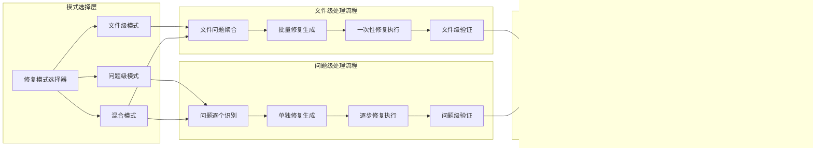

# AIDefectDetector 增强版Workflow架构设计

## 核心目标

### 1. 智能修复模式选择
- **文件级修复模式**：以文件为最小单位，聚合修复同一文件的所有问题
- **问题级修复模式**：以问题为最小单位，逐个独立修复每个问题
- **智能模式推荐**：基于项目特征和历史数据推荐最佳修复模式

### 2. 并行Agent系统优化
- **Agent身份识别**：唯一的Agent身份系统和完整的推理追踪机制
- **上下文污染隔离**：分层上下文管理和智能压缩技术
- **结果冲突解决**：冲突检测和智能聚合机制
- **内存竞争管理**：线程安全的并行协调器

### 3. LLM工具调用系统
- **智能工具选择**：LLM自主选择和调用相关工具
- **动态执行控制**：基于任务完成度决定是否继续调用
- **结果聚合优化**：工具调用结果与上下文的智能融合

## 整体架构图

## 分功能架构图

### 1. 并行Agent系统架构

### 2. 修复模式工作流架构

### 3. LLM工具调用架构

## 核心工作流程

### 1. 增强版Phase A: 智能文件选择与模式决策

### 2. 文件级修复工作流

### 3. LLM工具调用流程

## 需要实现的核心任务

### T001: Agent身份管理系统
**文件**: `src/agent/agent_identity_manager.py`
**功能**:
- 唯一Agent ID生成: `{phase}_agent_{index}_{timestamp}`
- Agent生命周期管理
- 推理过程追踪记录
- Agent性能监控

**验收标准**:
- 每个Agent都有唯一身份标识
- 完整记录Agent的推理过程和决策依据
- 支持Agent创建、执行、销毁的完整生命周期
- 提供Agent性能统计和分析功能

### T002: 分层上下文管理系统
**文件**: `src/context/layered_context_manager.py`
**功能**:
- Project Context: 项目元数据、文件依赖、配置信息
- Session Context: 阶段状态、用户决策、Agent交互记录
- Agent Context: 隔离环境、推理追踪、临时缓存
- 智能上下文压缩和相关性检索

**验收标准**:
- 三层上下文完全隔离，互不污染
- 支持基于语义匹配的智能记忆调用
- 实现时序分析的推理连续性
- 根据Agent类型动态调整记忆保留策略

### T003: 并行协调器系统
**文件**: `src/coordination/parallel_coordinator.py`
**功能**:
- 线程安全的任务调度
- 基于复杂度的负载均衡
- 故障自动恢复和降级处理
- 内存和并发数量的动态管控

**验收标准**:
- 支持多Agent并行执行且线程安全
- 实现智能任务调度和负载均衡
- 提供完善的故障恢复机制
- 支持资源的动态管控和监控

### T004: 冲突检测与解决系统
**文件**: `src/conflict/conflict_resolution_manager.py`
**功能**:
- 多Agent结果冲突检测
- 冲突类型识别和分类
- 多种解决策略(投票、置信度、权威、学习)
- 智能结果聚合和质量验证

**验收标准**:
- 能够检测各种类型的Agent结果冲突
- 提供多种冲突解决策略
- 实现智能结果聚合算法
- 包含完整的质量验证机制

### T005: 修复模式选择器
**文件**: `src/workflow/repair_mode_selector.py`
**功能**:
- 项目特征分析和模式推荐
- 文件级修复模式支持
- 问题级修复模式支持
- 混合修复模式支持

**验收标准**:
- 能够基于项目特征智能推荐修复模式
- 完整实现文件级修复工作流
- 完整实现问题级修复工作流
- 支持模式切换和混合使用

### T006: 文件级修复处理器
**文件**: `src/repair/file_level_repairer.py`
**功能**:
- 按文件聚合检测到的问题
- 生成文件级别的综合修复方案
- 一次性执行文件修复
- 文件级别的修复验证

**验收标准**:
- 能够将同一文件的所有问题聚合处理
- 生成符合文件整体逻辑的修复方案
- 支持一次性批量修复执行
- 提供文件级别的完整验证机制

### T007: 问题级修复处理器
**文件**: `src/repair/problem_level_repairer.py`
**功能**:
- 逐个处理检测到的问题
- 为每个问题生成独立修复方案
- 渐进式修复执行
- 问题级别的精确验证

**验收标准**:
- 支持逐个问题的独立处理
- 每个问题都有对应的修复方案
- 实现渐进式修复执行流程
- 提供问题级别的精确验证

### T008: LLM工具调用框架
**文件**: `src/llm/tool_calling_framework.py`
**功能**:
- 智能工具选择和调用
- 动态执行控制机制
- 工具调用结果聚合
- 完成度评估和继续决策

**验收标准**:
- LLM能够自主选择和调用相关工具
- 基于任务完成度动态控制执行流程
- 实现工具调用结果的智能聚合
- 提供准确的完成度评估机制

### T009: 智能工具集
**文件**: `src/tools/intelligent_toolkit.py`
**功能**:
- 代码分析工具集
- 修复生成工具集
- 验证测试工具集
- 上下文管理工具集

**验收标准**:
- 提供完整的代码分析工具
- 支持多种修复生成策略
- 包含全面的验证测试功能
- 实现高效的上下文管理

### T010: 结果聚合与报告系统
**文件**: `src/result/aggregation_reporter.py`
**功能**:
- 多Agent结果聚合
- 修复效果评估
- 详细报告生成
- 历史记录管理

**验收标准**:
- 能够聚合多个Agent的执行结果
- 提供全面的修复效果评估
- 生成详细易懂的分析报告
- 支持历史记录的查询和管理

## 技术实现要点

### 1. 向后兼容性
- 保持现有API接口不变
- 新功能以模块化方式插入
- 支持渐进式功能升级
- 提供配置开关控制新功能

### 2. 性能优化
- 智能缓存机制减少重复计算
- 并行处理提升整体效率
- 内存优化避免资源浪费
- 动态负载均衡保证稳定

### 3. 可扩展性
- 模块化设计便于功能扩展
- 插件式架构支持自定义工具
- 标准化接口便于第三方集成
- 配置驱动支持灵活定制

### 4. 安全性
- 完整的权限控制机制
- 敏感信息加密保护
- 操作日志完整记录
- 异常情况安全处理

## 实施计划

### 阶段1: 基础架构搭建 (2周)
- T001: Agent身份管理系统
- T002: 分层上下文管理系统
- T003: 并行协调器系统

### 阶段2: 核心功能实现 (3周)
- T004: 冲突检测与解决系统
- T005: 修复模式选择器
- T006: 文件级修复处理器
- T007: 问题级修复处理器

### 阶段3: LLM集成与工具开发 (2周)
- T008: LLM工具调用框架
- T009: 智能工具集

### 阶段4: 集成测试与优化 (1周)
- T010: 结果聚合与报告系统
- 系统集成测试
- 性能优化和bug修复

### 阶段5: 文档完善与部署 (1周)
- 完善技术文档
- 用户手册编写
- 部署指南制作
- 培训材料准备

总预计工期: 9周

## 质量保证

### 1. 测试策略
- 单元测试覆盖率 > 90%
- 集成测试覆盖主要工作流
- 性能测试验证并发能力
- 安全测试确保系统安全

### 2. 代码质量
- 遵循项目编码规范
- 完整的类型注解
- 详细的文档字符串
- 定期的代码审查

### 3. 监控指标
- Agent执行成功率
- 修复完成时间
- 内存使用情况
- 用户满意度评分