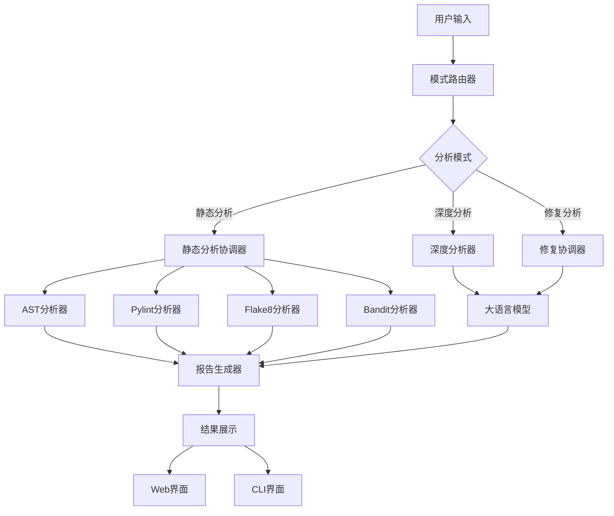

# 📊 AIDefectDetector 项目概览

## 🎯 项目定位

AIDefectDetector是一个**基于AI Agent的智能代码缺陷检测与修复系统**，旨在为开发者提供自动化、智能化的代码质量保障工具。

## 🏗️ 系统架构

### 核心设计理念
- **AI Agent架构**：模拟人类专家的分析思维过程
- **多模式协作**：静态分析、深度分析、修复分析三种模式协同工作
- **工具集成**：集成多种成熟的分析工具
- **用户友好**：提供CLI和Web双界面

### 技术架构图

## 📈 项目发展历程

### 第一阶段：基础框架搭建 ✅
- ✅ 完成AI Agent核心架构
- ✅ 实现三种分析模式
- ✅ 集成多种分析工具
- ✅ 建立配置和日志系统

### 第二阶段：用户界面开发 ✅
- ✅ 完成CLI命令行界面
- ✅ 完成Web可视化界面
- ✅ 实现文件上传功能
- ✅ 实现实时进度显示

### 第三阶段：智能修复功能 ✅
- ✅ 完成T031修复操作界面
- ✅ 实现代码对比显示
- ✅ 实现修复建议生成
- ✅ 实现修复结果展示

### 第四阶段：测试与优化 ✅
- ✅ 完成904个测试用例
- ✅ 实现测试覆盖率98.9%
- ✅ 完成性能优化
- ✅ 完成文档整理

## 🎯 核心功能模块

### 1. AI Agent核心 (`src/agent/`)

#### 🎭 任务编排器 (Orchestrator)
- **职责**：协调整个分析流程
- **功能**：会话管理、状态控制、任务调度
- **特点**：支持上下文记忆，提供连续性体验

#### 📋 任务规划器 (Planner)
- **职责**：将用户请求分解为可执行任务
- **功能**：请求解析、任务分解、执行计划生成
- **特点**：智能任务分解，支持复杂分析场景

#### ⚙️ 执行引擎 (Execution Engine)
- **职责**：执行具体的分析任务
- **功能**：工具调用、任务调度、结果收集
- **特点**：支持并行执行，异步任务处理

#### 🔄 模式路由器 (Mode Router)
- **职责**：智能识别用户意图，路由到合适的分析模式
- **功能**：意图识别、模式选择、策略路由
- **特点**：基于关键词和上下文的智能路由

### 2. 分析工具集成 (`src/tools/`)

#### 🔍 静态分析工具
- **AST分析器**：语法结构分析，代码结构理解
- **Pylint分析器**：代码质量检查，最佳实践验证
- **Flake8分析器**：代码风格检查，PEP8规范验证
- **Bandit分析器**：安全漏洞检测，常见安全问题扫描

#### 🤖 智能分析工具
- **深度分析器**：结合LLM的智能代码分析
- **修复生成器**：基于AI的修复建议生成
- **修复执行器**：安全的代码修复执行

### 3. 用户界面 (`src/interfaces/`)

#### 💻 命令行界面 (CLI)
- **特点**：轻量级、适合自动化脚本
- **功能**：三种分析模式、批量处理、结果导出
- **使用场景**：CI/CD集成、批量分析

#### 🌐 Web界面 (Web)
- **特点**：可视化、用户友好、功能丰富
- **功能**：文件上传、实时进度、结果展示、修复操作
- **使用场景**：交互式分析、团队协作

### 4. 大语言模型集成 (`src/llm/`)

#### 🔌 多厂商支持
- **OpenAI**：GPT系列模型支持
- **Anthropic**：Claude系列模型支持
- **智谱AI**：GLM系列模型支持

#### 🛡️ 安全特性
- **API密钥管理**：安全的密钥存储和访问
- **请求限制**：合理的调用频率控制
- **错误处理**：完善的异常处理机制

## 🎯 T031修复操作界面详解

### ✅ 已完成功能

#### 📊 代码对比显示
- **专业diff-viewer组件**：基于LCS算法的精确差异对比
- **行级对比**：逐行显示代码变更
- **语法高亮**：支持多种编程语言的语法高亮
- **统计信息**：显示添加、删除、未变更的行数统计

#### 🔘 确认和取消按钮
- **Bootstrap模态框**：专业的确认界面
- **安全检查清单**：修复前的安全确认
- **详细修复信息**：显示修复影响和风险
- **用户控制权**：用户完全控制修复执行

#### 📈 修复进度显示
- **步骤化进度**：清晰的修复步骤展示
- **实时状态更新**：动态显示修复进度
- **详细步骤信息**：每个步骤的详细描述
- **时间统计**：显示修复耗时统计

#### 📋 修复结果摘要
- **修复统计**：成功的修复数量统计
- **文件变更**：修改文件的详细信息
- **备份信息**：备份文件的存储位置
- **风险评估**：修复操作的风险评估

### 🎨 界面特性

#### 📱 响应式设计
- **多设备适配**：支持桌面端和移动端
- **Bootstrap框架**：专业的UI组件库
- **流畅交互**：优秀的用户体验

#### 🎭 交互功能
- **拖拽上传**：便捷的文件上传方式
- **实时进度**：分析进度的实时反馈
- **结果导出**：支持多种格式的结果导出

## 📊 测试覆盖情况

### 测试统计
- **总测试用例**：904个
- **通过率**：98.9%
- **覆盖模块**：所有核心模块
- **测试类型**：单元测试、集成测试、功能测试

### T031专项测试
- **测试用例**：27个
- **通过率**：100%
- **测试内容**：
  - 修复页面访问和渲染
  - API接口功能测试
  - 数据导出功能测试
  - 用户交互流程测试
  - 性能和兼容性测试

## 🚀 性能特点

### ⚡ 分析速度
- **静态分析**：毫秒级响应
- **深度分析**：秒级响应（取决于LLM）
- **修复分析**：秒级响应（取决于LLM）

### 💾 资源优化
- **并行处理**：多文件并行分析
- **缓存机制**：避免重复分析
- **内存管理**：合理的内存使用
- **增量分析**：仅分析变更文件

### 🔄 可扩展性
- **模块化设计**：易于扩展新功能
- **插件架构**：支持自定义分析工具
- **配置灵活**：丰富的配置选项
- **API友好**：良好的API设计

## 🎯 应用场景

### 👨‍💻 个人开发者
- **代码质量检查**：日常开发中的代码质量保障
- **学习提升**：通过AI分析学习最佳实践
- **项目重构**：获得重构建议和方向指导

### 👥 团队协作
- **代码审查**：辅助代码审查工作
- **标准统一**：帮助团队统一代码标准
- **知识分享**：分享分析结果和最佳实践

### 🏢 企业应用
- **CI/CD集成**：自动化代码质量检查
- **技术债务管理**：系统性评估技术债务
- **安全合规**：定期安全漏洞检测

## 🔮 未来发展方向

### 短期目标
- **更多语言支持**：扩展对更多编程语言的支持
- **IDE集成**：开发VS Code、JetBrains插件
- **云服务**：提供云端分析服务

### 长期愿景
- **全自动修复**：实现代码的自动修复
- **智能重构**：基于AI的代码重构建议
- **知识图谱**：构建代码知识图谱

## 📈 项目价值

### 🎯 技术价值
- **AI Agent实践**：AI Agent在软件开发领域的成功应用
- **工具集成**：多种分析工具的有机整合
- **模式创新**：三种分析模式的创新组合

### 💼 商业价值
- **提升效率**：显著提升代码分析和修复效率
- **降低成本**：减少人工代码审查成本
- **质量保障**：提高代码质量和安全性

### 🎓 教育价值
- **最佳实践**：帮助开发者学习编码最佳实践
- **知识传播**：传播先进的代码分析技术
- **技能提升**：提升开发者的代码分析能力

---

**AIDefectDetector** - 让代码分析更智能，让修复过程更简单！ 🚀