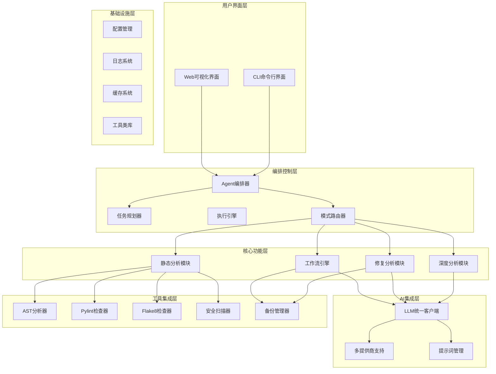
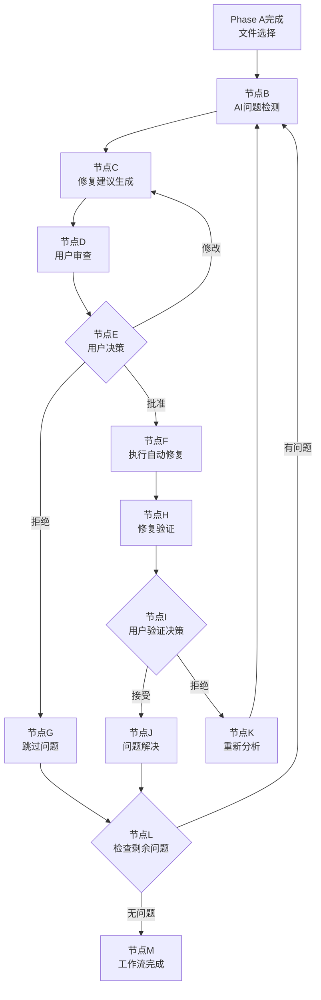
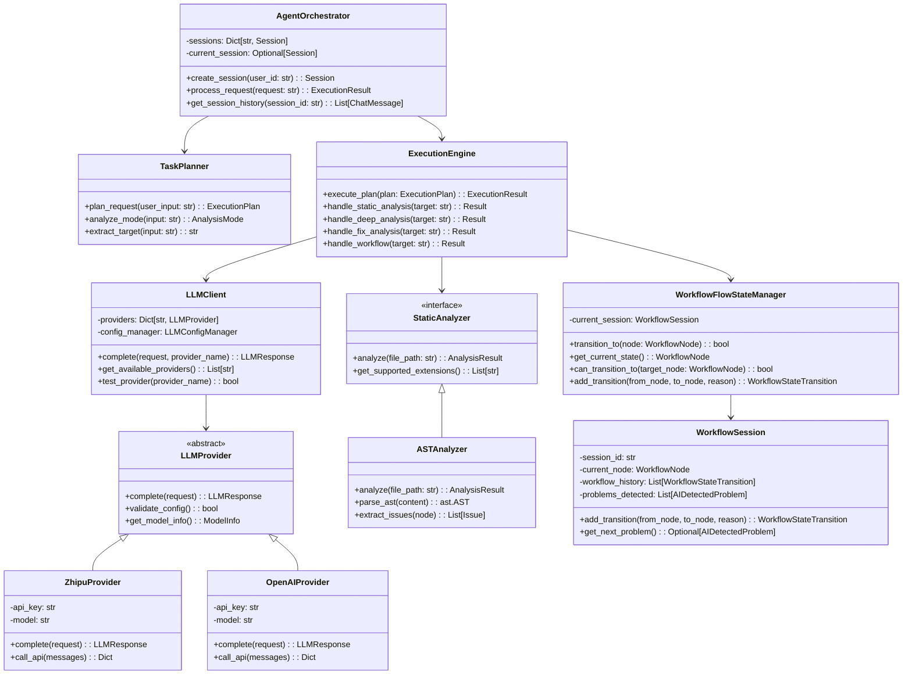
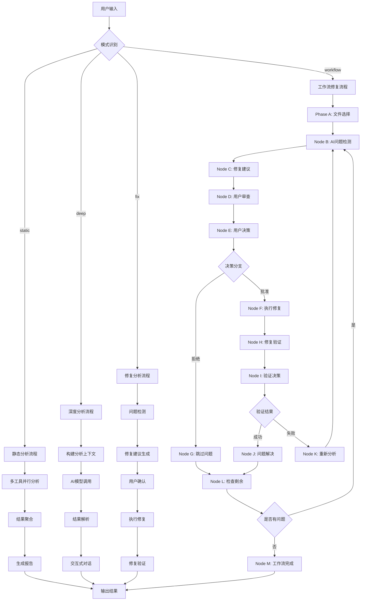
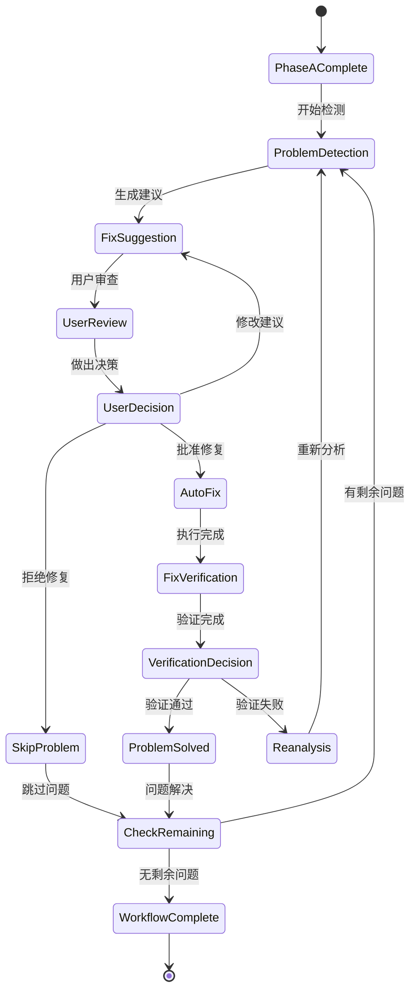
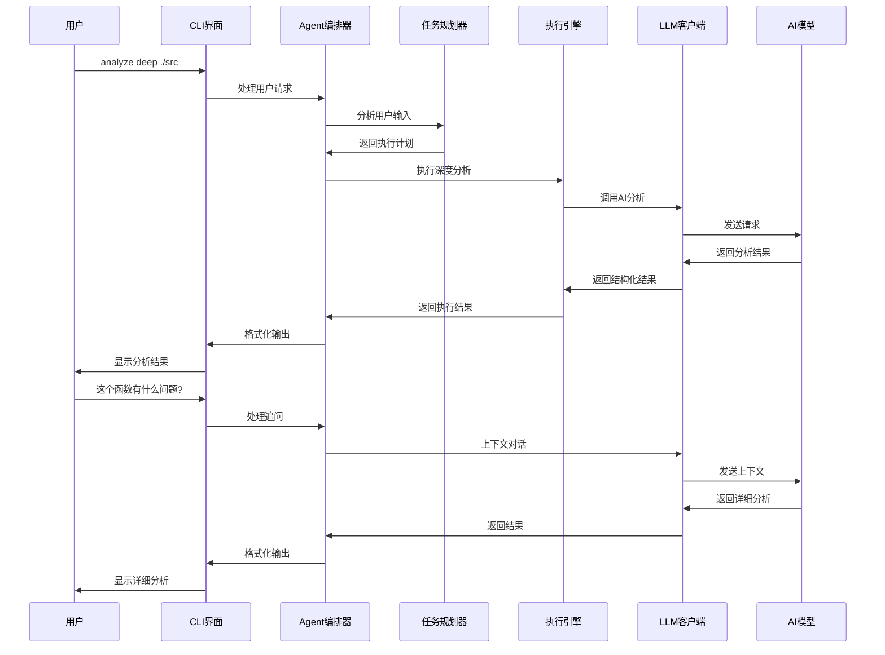

# 🤖 AIDefectDetector

<div align="center">


**基于AI Agent的智能代码缺陷检测与修复系统**

[🚀 快速开始](docs/QUICKSTART.md) • [📖 安装指南](docs/Guide/INSTALL_GUIDE.md) • [🔑 API配置](docs/Guide/API_CONFIG_GUIDE.md)

</div>

---

## 📋 项目概览

AIDefectDetector是一个基于AI Agent架构的智能化代码缺陷检测与修复系统，能够自主理解项目上下文、利用多种分析工具、制定决策并执行修复任务。系统采用模块化设计，支持四种智能工作模式和完整的AI驱动修复工作流。

### ✨ 核心特性

#### 🎯 四种智能工作模式
- **📊 静态分析模式** - 基于传统工具的快速代码检查（零成本）
- **🧠 深度分析模式** - AI智能代码分析和深度洞察
- **🔧 修复分析模式** - AI驱动的问题检测和自动修复
- **🔄 工作流修复模式** - 完整的B→C→D→E→F/G→H→I→J/K→L→B/M AI修复工作流 ⭐

#### 🖥️ 双界面支持
- **💻 CLI界面** - 适合开发者和自动化脚本，支持交互式对话
- **🌐 Web界面** - 直观的可视化操作界面，支持拖拽上传

#### 🛠️ 丰富的分析工具
- **AST语法分析器** - 深度解析代码结构
- **多语言静态分析** - Pylint、Flake8、Bandit集成
- **AI智能检测** - 基于大模型的深度问题发现
- **安全扫描** - 常见安全漏洞检测

#### 🎯 智能化功能
- **🤖 AI驱动决策** - 智能文件选择、问题分析、修复建议
- **👥 用户协作机制** - AI建议 + 用户决策的反馈循环
- **🔄 完整工作流** - 从问题发现到修复验证的闭环流程
- **📊 详细追踪** - 实时显示分析进度和详细结果

## 🏗️ 系统架构

### 整体架构设计



### 核心设计模式

#### 🎭 Agent架构模式
- **编排器模式** - `AgentOrchestrator` 统一协调所有组件
- **策略模式** - `ModeRouter` 根据用户需求选择分析策略
- **命令模式** - 各分析模块实现统一的命令接口
- **观察者模式** - 用户交互处理器监听用户决策

#### 🔄 工作流状态机模式
- **状态模式** - `WorkflowFlowStateManager` 管理复杂的状态转换
- **责任链模式** - 工作流各节点按顺序处理
- **备忘录模式** - 工作流会话的备份和恢复

#### 🏭 工厂模式
- **抽象工厂** - `LLMProvider` 创建不同LLM提供商实例
- **建造者模式** - 提示词的构建和渲染
- **单例模式** - 配置管理器和日志系统

#### 🎯 策略模式
- **多态分析器** - 不同编程语言的静态分析策略
- **渲染器策略** - 不同格式的报告生成
- **验证策略** - 不同类型的修复验证

## 🚀 快速开始

### 📦 一键安装

```bash
# 克隆项目
git clone <repository-url>
cd AIDefectDetector

# 运行安装脚本
bash scripts/install_unix.sh  # Linux/macOS
scripts\install_windows.bat   # Windows
```

### ⚡ 5分钟体验

```bash
# 1. 配置API密钥（推荐智谱AI）
python3 scripts/configure_llm.py --provider zhipu

# 2. 静态分析（无需API密钥）
python3 main.py analyze static ./src

# 3. 深度分析（需要API密钥）
python3 main.py analyze deep ./src

# 4. 工作流修复（推荐）
python3 main.py analyze workflow ./src

# 5. Web界面
python3 main.py web
```

### 🔧 现代化构建方式 (pyproject.toml)

项目支持现代 Python 项目构建标准，使用 `pyproject.toml` 配置文件：

```bash
# 安装构建依赖
pip install build

# 构建分发包
python -m build

# 生成的包位于 dist/ 目录：
# - aidefect-1.0.0-py3-none-any.whl (wheel包)
# - aidefect-1.0.0.tar.gz (源码包)

# 安装构建的包
pip install dist/aidefect-1.0.0-py3-none-any.whl

# 开发模式安装
pip install -e .

# 安装特定功能组合
pip install -e .[dev]          # 开发工具
pip install -e .[web]          # Web界面增强
pip install -e .[all]          # 完整功能
```

## 📊 使用示例

### 静态分析模式
```bash
# 分析整个项目
python3 main.py analyze static /path/to/project

# 使用特定工具
python3 main.py analyze static ./src --tools pylint,bandit

# 生成详细报告
python3 main.py analyze static ./src --format json --output report.json
```

### 深度分析模式
```bash
# 交互式深度分析
python3 main.py analyze deep ./src --interactive

# 指定模型
python3 main.py analyze deep ./src --model glm-4.5

# 详细输出
python3 main.py analyze deep ./src/utils/config.py --verbose
```

### 工作流修复模式 ⭐
```bash
# 启动完整工作流
python3 main.py analyze workflow ./src

# 详细流程追踪
python3 main.py analyze workflow ./src --verbose

# 模拟运行
python3 main.py analyze workflow ./src --dry-run

# 导出结果
python3 main.py analyze workflow ./src --output workflow_results.json
```

## 🔄 工作流模式详解

工作流模式是系统的核心功能，实现了完整的AI驱动修复闭环：



### 工作流特点
- 🤖 **AI驱动** - 问题检测和修复建议完全由AI完成
- 👥 **用户协作** - 关键决策点需要用户确认和建议
- 🔄 **闭环流程** - 从问题发现到修复验证的完整闭环
- 🛡️ **安全保护** - 自动备份和回滚机制
- 📊 **流程追踪** - 详细记录每个步骤的执行情况

## 🛠️ 技术栈

### 核心框架
- **Python 3.8+** - 主要开发语言
- **Flask** - Web界面框架
- **Loguru** - 结构化日志系统
- **PyYAML** - 配置文件管理

### AI集成
- **智谱AI SDK** - GLM-4系列模型
- **OpenAI API** - GPT系列模型
- **Anthropic API** - Claude系列模型

### 静态分析工具
- **AST** - Python语法树分析
- **Pylint** - 代码质量检查
- **Flake8** - 代码风格检查
- **Bandit** - 安全漏洞检测

### 开发工具
- **pytest** - 测试框架
- **black** - 代码格式化
- **mypy** - 类型检查
- **isort** - 导入排序

## 📁 项目结构

```
AIDefectDetector/
├── 📄 main.py                      # 主程序入口
├── 📁 src/                         # 核心源代码
│   ├── 🤖 agent/                    # Agent核心逻辑
│   │   ├── orchestrator.py         # 编排器 - 核心协调器
│   │   ├── planner.py               # 任务规划器
│   │   ├── execution_engine.py      # 执行引擎
│   │   ├── mode_router.py           # 模式路由器
│   │   ├── file_selector.py         # 智能文件选择器
│   │   └── user_interaction.py     # 用户交互处理器
│   ├── 🖥️ interfaces/               # 接口层
│   │   ├── cli.py                   # CLI命令行界面
│   │   ├── web.py                   # Web可视化界面
│   │   ├── workflow_commands.py     # 工作流命令处理
│   │   ├── static_commands.py       # 静态分析命令
│   │   ├── deep_commands.py         # 深度分析命令
│   │   └── fix_commands.py          # 修复分析命令
│   ├── 🧠 llm/                       # LLM集成模块
│   │   ├── client.py                # 统一LLM客户端
│   │   ├── config.py                # LLM配置管理
│   │   ├── zhipu_provider.py        # 智谱AI提供商
│   │   ├── openai_provider.py       # OpenAI提供商
│   │   ├── anthropic_provider.py    # Anthropic提供商
│   │   └── mock_provider.py         # Mock测试提供商
│   ├── 🛠️ tools/                     # 工具集成模块
│   │   ├── workflow_flow_state_manager.py  # 工作流状态管理
│   │   ├── multilang_static_analyzer.py   # 多语言静态分析
│   │   ├── ai_problem_detector.py           # AI问题检测器
│   │   ├── ai_fix_suggestion_generator.py   # AI修复建议生成器
│   │   ├── verification_static_analyzer.py  # 修复验证分析器
│   │   ├── backup_manager.py               # 备份管理器
│   │   ├── ast_analyzer.py                 # AST语法分析器
│   │   ├── pylint_analyzer.py              # Pylint分析器
│   │   ├── flake8_analyzer.py              # Flake8分析器
│   │   └── bandit_analyzer.py              # Bandit安全分析器
│   ├── 💡 prompts/                   # 提示词管理
│   │   ├── manager.py               # 提示词管理器
│   │   ├── templates.py             # 提示词模板
│   │   └── renderer.py              # 提示词渲染器
│   └── 🔧 utils/                     # 工具类库
│       ├── config.py                # 配置管理器
│       ├── logger.py                # 日志系统
│       ├── cache.py                 # 缓存管理
│       └── path_resolver.py         # 路径解析器
├── 📁 config/                        # 配置文件
│   ├── llm_config.yaml             # LLM提供商配置
│   ├── project_analysis_config.yaml # 项目分析配置
│   └── examples/                    # 配置模板
├── 📁 scripts/                       # 管理脚本 ⭐
│   ├── install_unix.sh             # Unix/Linux/macOS安装脚本
│   ├── install_windows.bat         # Windows安装脚本
│   └── configure_llm.py            # LLM配置统一脚本
├── 📁 docs/                          # 文档 📚
│   ├── QUICKSTART.md               # 🚀 快速开始指南
│   └── Guide/                      # 详细指南
│       ├── INSTALL_GUIDE.md         # 📦 安装指南
│       └── API_CONFIG_GUIDE.md      # 🔑 API配置指南
├── 📁 example/                       # 示例项目
├── 📁 tests/                         # 测试套件
├── 📁 .fix_backups/                 # 修复备份系统
└── 📁 .workflow_sessions/            # 工作流会话记录
```

## 🧪 类图



## 🔄 主要流程图

### 1. 整体分析流程



### 2. 工作流状态机流程



### 3. AI交互流程



## 🎯 设计模式详解

### 1. Agent架构模式
```python
class AgentOrchestrator:
    """编排器模式 - 统一协调所有组件"""
    def __init__(self):
        self.planner = TaskPlanner()
        self.engine = ExecutionEngine()
        self.router = ModeRouter()

    def process_request(self, user_input: str):
        plan = self.planner.plan_request(user_input)
        return self.engine.execute_plan(plan)
```

### 2. 策略模式
```python
class ModeRouter:
    """策略模式 - 根据用户需求选择分析策略"""
    def __init__(self):
        self.strategies = {
            'static': StaticAnalysisStrategy(),
            'deep': DeepAnalysisStrategy(),
            'fix': FixAnalysisStrategy(),
            'workflow': WorkflowStrategy()
        }

    def route_request(self, request: RouteRequest) -> RouteResult:
        strategy = self.strategies[request.mode]
        return strategy.execute(request)
```

### 3. 状态模式
```python
class WorkflowFlowStateManager:
    """状态模式 - 管理复杂的工作流状态转换"""
    def __init__(self):
        self.current_node = WorkflowNode.PHASE_A_COMPLETE
        self.state_handlers = {
            WorkflowNode.PROBLEM_DETECTION: self._handle_problem_detection,
            WorkflowNode.FIX_SUGGESTION: self._handle_fix_suggestion,
            # ... 其他状态处理器
        }

    def transition_to(self, target_node: WorkflowNode):
        handler = self.state_handlers[target_node]
        return handler()
```

### 4. 工厂模式
```python
class LLMProviderFactory:
    """抽象工厂模式 - 创建不同LLM提供商"""
    @staticmethod
    def create_provider(provider_name: str) -> LLMProvider:
        if provider_name == "zhipu":
            return ZhipuProvider()
        elif provider_name == "openai":
            return OpenAIProvider()
        elif provider_name == "anthropic":
            return AnthropicProvider()
        else:
            raise ValueError(f"Unsupported provider: {provider_name}")
```

## 📊 技术特性

### 🎯 核心功能特性
- ✅ **多模式分析** - 静态、深度、修复、工作流四种模式
- ✅ **智能文件选择** - AI驱动的文件选择策略
- ✅ **多LLM支持** - 智谱AI、OpenAI、Anthropic多提供商
- ✅ **完整工作流** - B→C→D→E→F/G→H→I→J/K→L→B/M闭环
- ✅ **用户协作** - AI建议 + 用户决策的反馈机制
- ✅ **安全保护** - 自动备份和回滚机制
- ✅ **双界面支持** - CLI和Web两种交互方式

### 🛠️ 技术架构特性
- ✅ **模块化设计** - 清晰的分层架构
- ✅ **异步支持** - 支持异步处理和并发
- ✅ **配置管理** - 灵活的配置系统
- ✅ **缓存优化** - 智能缓存提升性能
- ✅ **日志追踪** - 完整的操作日志
- ✅ **错误处理** - 健壮的异常处理机制
- ✅ **扩展性** - 易于扩展新的分析工具

### 🔧 开发特性
- ✅ **类型安全** - 完整的类型注解
- ✅ **测试覆盖** - 单元测试和集成测试
- ✅ **代码质量** - Black、Flake8、MyPy检查
- ✅ **文档完善** - 详细的API文档和用户指南
- ✅ **CI/CD就绪** - 支持自动化构建和部署

## 🚀 性能优化

### 📈 性能指标
- ⚡ **静态分析** - 毫秒级响应
- 🧠 **深度分析** - 秒级响应（取决于AI响应时间）
- 🔄 **工作流处理** - 支持大项目和复杂场景
- 💾 **内存使用** - 智能缓存，避免重复计算
- 🌐 **并发处理** - 支持多文件并行分析

### 🔧 优化策略
- **智能缓存** - 分析结果缓存，避免重复计算
- **并行处理** - 多文件并行分析提升效率
- **流式响应** - 大文本分块处理
- **懒加载** - 按需加载模块和工具
- **资源管理** - 智能内存和连接管理

## 📞 支持与贡献

### 📖 文档资源
- [🚀 快速开始](docs/QUICKSTART.md) - 5分钟上手指南
- [📦 安装指南](docs/Guide/INSTALL_GUIDE.md) - 详细安装说明
- [🔑 API配置](docs/Guide/API_CONFIG_GUIDE.md) - LLM配置指南

### 🤝 获取帮助
```bash
# 运行诊断工具
python3 scripts/configure_llm.py --diagnose

# 查看配置状态
python3 scripts/configure_llm.py --status

# 测试API连接
python3 scripts/configure_llm.py --test zhipu
```

### 🐛 问题反馈
- 提交Issue报告问题
- 查看Wiki获取更多信息
- 参与社区讨论

### 🔧 贡献指南
欢迎提交Pull Request！
- Fork项目
- 创建功能分支
- 提交更改
- 发起Pull Request

## 📄 许可证

本项目采用 [MIT License](LICENSE) 许可证。

---

<div align="center">

**🚀 让AI成为您的代码质量守护者！**

[⭐ 给我们一个Star](https://github.com/3uyuan1ee/Fix_agent) • [🐛 报告问题](https://github.com/3uyuan1ee/Fix_agent/issues) • [📖 查看文档](docs/)

</div>