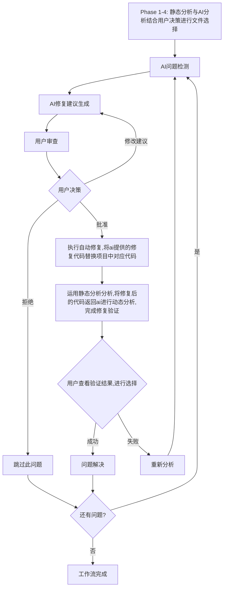

# 原子级任务分解 - AI驱动的智能项目分析与修复工作流

## 项目核心目标与工作流设计

### 核心目标
1. **AI驱动**: 将文件选择、问题分析、修复建议、自动修复等复杂决策交给AI处理
2. **简化架构**: 最小化代码复杂度，最大化AI能力利用
3. **用户协作**: AI提供分析建议，用户做出最终决策，支持反馈循环
4. **固定格式**: AI返回结构化JSON结果，便于程序解析和自动化执行
5. **交互式体验**: 支持实时对话和渐进式分析
6. **成本控制**: 通过智能提示词设计优化token使用
7. **多语言支持**: 支持Python、JavaScript、Java、Go、C++等多种编程语言
8. **完整修复工作流**: 从问题发现到自动修复再到验证的完整闭环

### 严格遵循的工作流程图

### 原子级任务设计原则
每个任务必须：
- **工作流明确**: 清楚说明在工作流中的位置和作用
- **严格遵循流程**: 完全按照工作流图的步骤和逻辑设计
- **AI集成**: 体现AI驱动的核心思想
- **用户协作**: 支持用户交互和决策
- **可测试性**: 验收标准可直接验证

---

## Phase 0: 核心基础架构评估

### 现有Phase 0任务状态 ✅

**T001: 项目分析数据结构** ✅
- 文件: `src/tools/project_analysis_types.py`
- 状态: 已完成
- 功能: 基础数据类定义，支持整个工作流的数据结构需求
- 工作流位置: 为所有Phase提供数据结构基础

**T002: 项目分析配置管理** ✅
- 文件: `config/project_analysis_config.yaml`
- 状态: 已完成
- 功能: 配置文件和加载器，支持多语言分析和AI参数配置
- 工作流位置: 为所有Phase提供配置支持

**T003: Logger模块扩展** ✅
- 文件: `src/utils/logger.py`
- 状态: 已完成
- 功能: 项目分析日志，支持工作流全程跟踪
- 工作流位置: 为所有Phase提供日志记录能力

## Phase 0适配度评估与完善建议

### 当前Phase 0状态评估

**现有Phase 0优势**:
1. ✅ **数据结构完备**: `project_analysis_types.py`提供了基础数据结构
2. ✅ **配置管理完善**: `project_analysis_config.yaml`支持多语言分析配置
3. ✅ **日志系统健全**: `logger.py`支持全程工作流跟踪

**Phase 0不足之处**:
1. ❌ **缺少AI集成基础**: 没有统一的LLM调用接口
2. ❌ **缺少工作流状态管理**: 没有严格按照工作流图的状态管理
3. ❌ **缺少用户交互基础**: 没有用户决策和反馈的数据结构
4. ❌ **缺少修复执行基础**: 没有代码修改和备份的基础架构

### Phase 0完善建议（严格按照工作流图需求）

**P001: LLM调用统一接口 - AI交互基础**
- 文件: `src/llm/unified_llm_client.py`
- 工作流位置: 支持节点B、C、H的AI交互
- 核心功能: 为所有AI调用提供统一接口
- 验收标准:
    - 支持多个AI提供商（智谱、OpenAI、Anthropic）
    - 统一的调用接口和错误处理机制
    - 支持工作流图中所有AI交互节点
    - 提供调用重试和超时控制
    - 支持token使用统计和成本控制

**P002: 工作流状态管理器 - 流程控制基础**
- 文件: `src/tools/workflow_state_manager.py`
- 工作流位置: 管理整个工作流图的状态转换
- 核心功能: 严格按照工作流图管理状态转换
- 验收标准:
    - 完整支持工作流图中的所有节点状态
    - 严格按照B→C→D→E→F/G→H→I→J/K→L→B/M的转换逻辑
    - 支持循环和分支的状态管理
    - 提供状态持久化和恢复机制
    - 记录完整的状态转换历史

**P003: 用户交互数据结构 - 用户协作基础**
- 文件: `src/tools/user_interaction_types.py`
- 工作流位置: 支持节点D、E、I、L的用户交互
- 核心功能: 定义用户决策和反馈的数据结构
- 验收标准:
    - 定义用户在节点E的三种决策数据结构
    - 定义用户在节点I的验证决策数据结构
    - 支持用户修改建议和反馈的数据结构
    - 提供用户决策历史的存储机制
    - 支持用户偏好和设置的管理

**P004: 代码修改执行基础 - 修复执行基础**
- 文件: `src/tools/code_modification_base.py`
- 工作流位置: 支持节点F的自动修复执行
- 核心功能: 提供安全的代码修改基础设施
- 验收标准:
    - 提供安全的文件备份和恢复机制
    - 支持精确的代码行级修改操作
    - 提供代码修改的验证和回滚功能
    - 记录详细的修改操作日志
    - 支持批量修改和事务性操作

### 完善后的Phase 0架构

**基础架构层**:
- 数据类型定义 (T001 ✅)
- 配置管理 (T002 ✅)
- 日志系统 (T003 ✅)
- LLM调用统一接口 (P001 新增)
- 工作流状态管理器 (P002 新增)
- 用户交互数据结构 (P003 新增)
- 代码修改执行基础 (P004 新增)

这样的Phase 0将为严格按照工作流图设计的原子级任务提供坚实的基础，确保每个任务都有明确的底层支持，实现真正意义上严格遵循工作流程的AI驱动、用户协作的智能项目分析与修复系统。

---

## Phase 1-4: 静态分析与AI分析结合用户决策进行文件选择

### Phase 1-4目标
基于工作流图节点A，完成项目静态分析，AI智能文件选择，用户最终决策确认，为Phase 5的修复工作流准备文件列表。

**T004.1: 项目结构扫描器 - 为AI分析提供基础数据**
- 文件: `src/tools/project_structure_scanner.py`
- 工作流位置: Phase 1第一步，为节点A的静态分析提供项目基础信息
- 核心功能: 扫描项目结构，识别文件类型和语言分布
- AI集成: 为后续AI文件选择提供项目结构数据
- 具体功能:
  - 递归扫描项目目录结构
  - 按扩展名识别和分类文件
  - 统计各编程语言文件数量
  - 识别配置文件和依赖文件
  - 生成项目基本信息字典
- 验收标准:
  - 输入项目路径，返回包含文件列表、语言分布、目录结构的基本信息
  - 正确识别Python、JS、Java、Go、C++文件
  - 处理扫描异常和权限问题
  - 在5秒内完成中等规模项目扫描
  - 输出格式符合AI分析要求

**T004.2: 多语言静态分析执行器 - 发现代码问题**
- 文件: `src/tools/multilang_static_analyzer.py`
- 工作流位置: Phase 1第二步，为节点A的静态分析核心
- 核心功能: 执行多语言静态分析，发现代码质量问题
- AI集成: 为AI文件选择提供问题密度和重要性的分析依据
- 具体功能:
  - Python: 集成AST、Pylint、Flake8、Bandit
  - JavaScript/TypeScript: 集成ESLint、TypeScript编译器
  - Java: 集成SpotBugs、Checkstyle、PMD
  - Go: 集成go vet、golint、staticcheck
  - C/C++: 集成Clang-tidy、Cppcheck
  - 统一问题格式输出
- 验收标准:
  - 支持5种主要编程语言的静态分析
  - 根据文件类型自动选择分析工具
  - 返回统一格式的问题列表{file, line, severity, type, description}
  - 处理工具执行异常和超时
  - 生成文件问题密度统计

**T004.3: 静态分析结果聚合器 - 数据整合**
- 文件: `src/tools/static_analysis_aggregator.py`
- 工作流位置: Phase 1第三步，为节点A整合静态分析结果
- 核心功能: 聚合多工具分析结果，为AI分析提供结构化输入
- AI集成: 将复杂分析结果转化为AI可理解的格式
- 具体功能:
  - 合并不同工具发现的重复问题
  - 按严重程度和文件进行问题分类
  - 计算文件问题密度和复杂度指标
  - 生成适合AI分析的结构化报告
  - 提供文件重要性初步评估
- 验收标准:
  - 输入多语言分析结果，返回聚合后的结构化数据
  - 正确识别和去重相同问题
  - 计算每个文件的问题统计和重要性评分
  - 生成JSON格式的AI分析输入数据
  - 包含项目概览、文件列表、问题分布、统计信息

**T005.1: AI文件选择提示词构建器 - AI决策准备**
- 文件: `src/prompts/ai_file_selection_prompt_builder.py`
- 工作流位置: Phase 2第一步，为节点A的AI分析构建提示词
- 核心功能: 将项目分析结果转化为高效的AI提示词
- AI集成: 直接与AI模型交互的核心组件
- 具体功能:
  - 整合项目结构、问题统计、文件重要性
  - 构建上下文丰富的文件选择提示词
  - 指定AI返回JSON格式的文件选择结果
  - 优化token使用和提示词结构
  - 包含用户需求和偏好设置
- 验收标准:
  - 输入项目分析数据，返回结构化提示词
  - 提示词包含项目上下文、问题摘要、用户需求
  - 明确要求AI返回{file_path, priority, reason, confidence}格式
  - 控制提示词长度在4000 token以内
  - 优化提示词提高AI响应质量

**T005.2: AI文件选择执行器 - AI核心决策**
- 文件: `src/tools/ai_file_selector.py`
- 工作流位置: Phase 2第二步，执行节点A的AI文件选择
- 核心功能: 调用AI模型智能选择需要分析的核心文件
- AI集成: 体现AI驱动的核心决策能力
- 具体功能:
  - 调用LLM执行文件选择分析
  - 解析AI返回的JSON格式选择结果
  - 验证选择结果的合理性和完整性
  - 提供选择置信度和理由分析
  - 处理AI调用异常和重试
- 验收标准:
  - 输入提示词，返回AI选择的文件列表
  - AI返回格式：{file_path, priority, reason, confidence}
  - 验证JSON格式和必需字段完整性
  - 文件选择考虑重要性、问题密度、用户需求
  - 处理AI调用失败并重试

**T006.1: AI建议展示器 - 用户决策支持**
- 文件: `src/tools/ai_recommendation_displayer.py`
- 工作流位置: Phase 3第一步，为节点A的用户决策展示AI建议
- 核心功能: 以用户友好的方式展示AI文件选择建议
- 用户协作: 提供透明的AI决策信息，支持用户理解
- 具体功能:
  - 格式化展示AI推荐的文件列表
  - 显示每个文件的选择理由和置信度
  - 提供文件预览和问题摘要
  - 支持按优先级排序和筛选
  - 展示选择统计和分析概览
- 验收标准:
  - 生成用户友好的AI建议展示界面
  - 清晰显示文件路径、优先级、选择理由
  - 提供文件内容预览功能
  - 支持交互式查看和筛选操作
  - 显示整体选择统计信息

**T006.2: 用户决策收集器 - 用户协作核心**
- 文件: `src/tools/user_decision_collector.py`
- 工作流位置: Phase 3第二步，收集节点A的用户最终决策
- 核心功能: 收集用户对AI建议的确认、修改或补充
- 用户协作: 实现用户最终决策权，体现人机协作
- 具体功能:
  - 支持用户确认、拒绝、修改AI建议
  - 提供批量选择和单独调整功能
  - 支持用户添加自定义文件选择
  - 记录用户修改操作和理由
  - 实时更新选择结果和统计
- 验收标准:
  - 支持用户对文件列表的增删改操作
  - 提供批量操作（全选、反选、清除）
  - 记录用户决策的详细历史
  - 实时更新选择统计显示
  - 支持用户添加AI未推荐的文件

**T007.1: 文件选择确认器 - 决策固化**
- 文件: `src/tools/file_selection_confirmer.py`
- 工作流位置: Phase 4最后一步，确认节点A的最终文件选择
- 核心功能: 固化用户最终决策，为Phase 5修复工作流准备输入
- 用户协作: 确保用户对最终选择的确认和控制
- 具体功能:
  - 生成最终确认的文件选择列表
  - 计算分析工作量和时间预估
  - 生成选择摘要报告供用户最终确认
  - 支持选择结果导出和备份
  - 为Phase 5准备标准化输入数据
- 验收标准:
  - 输入用户决策结果，返回最终文件选择列表
  - 计算分析工作量和预估执行时间
  - 生成详细的选择摘要报告
  - 支持选择结果导出为JSON格式
  - 与Phase 5修复工作流无缝衔接

---

## Phase 5: AI修复工作流 - 严格遵循工作流图

### Phase 5目标
严格遵循工作流图的完整流程：B→C→D→E→F/G→H→I→J/K→L→B/M，实现AI驱动的完整修复闭环。

### 节点B: AI问题检测

**T008.1: 问题检测上下文构建器 - AI分析准备**
- 文件: `src/tools/problem_detection_context_builder.py`
- 工作流位置: 节点B第一步，为AI问题检测构建上下文
- 核心功能: 将文件选择和静态分析结果转化为AI可理解的上下文
- AI集成: 为AI问题检测提供丰富的分析上下文
- 具体功能:
  - 整合文件选择列表和静态分析结果
  - 提取文件内容和上下文信息
  - 添加用户需求和检测重点
  - 优化上下文长度和结构
  - 构建AI问题检测的完整输入
- 验收标准:
  - 输入文件选择和静态分析结果，返回AI分析上下文
  - 包含文件内容、问题描述、重要性评分
  - 控制上下文长度在token限制内
  - 提供问题相关的代码片段和上下文
  - 支持用户指定的检测重点和偏好

**T008.2: AI问题检测执行器 - AI发现问题**
- 文件: `src/tools/ai_problem_detector.py`
- 工作流位置: 节点B核心，执行AI问题检测
- 核心功能: 调用AI基于上下文深度发现代码问题
- AI集成: 体现AI驱动的智能问题检测能力
- 具体功能:
  - 调用LLM执行深度问题检测
  - 发现静态分析工具遗漏的深层问题
  - 分析代码逻辑、架构、安全等问题
  - 返回结构化的问题检测结果
  - 支持用户指定的检测重点
- 验收标准:
  - 输入分析上下文，返回AI检测到的问题列表
  - AI返回JSON格式：{issue_id, file_path, line, issue_type, severity, description, code_snippet, confidence, reasoning}
  - 发现静态分析工具未能识别的深层问题
  - 支持安全问题、性能问题、架构问题检测
  - 问题置信度评分和详细推理过程

**T008.3: 问题检测结果验证器 - 结果质量保证**
- 文件: `src/tools/problem_detection_validator.py`
- 工作流位置: 节点B第三步，验证AI检测结果的质量
- 核心功能: 验证AI检测问题的准确性和可操作性
- AI集成: 评估AI问题检测的质量，为后续步骤提供可靠输入
- 具体功能:
  - 验证AI检测结果的格式正确性
  - 检查问题位置和代码片段的准确性
  - 评估问题描述的清晰度和可操作性
  - 过滤低质量或不可操作的问题
  - 生成问题质量评估报告
- 验收标准:
  - 验证AI返回JSON格式的正确性
  - 检查文件路径、行号、代码片段的准确性
  - 评估问题描述的清晰度和可操作性
  - 过滤置信度过低或描述模糊的问题
  - 生成适合用户审查的最终问题列表

### 节点C: AI修复建议生成

**T009.1: 修复建议上下文构建器 - 修复分析准备**
- 文件: `src/tools/fix_suggestion_context_builder.py`
- 工作流位置: 节点C第一步，为AI修复建议构建上下文
- 核心功能: 为AI修复建议生成提供充分的上下文信息
- AI集成: 提高AI修复建议的准确性和针对性
- 具体功能:
  - 整合问题描述和相关代码上下文
  - 提供文件的完整上下文和依赖信息
  - 包含用户修复偏好和约束条件
  - 构建AI生成修复建议的完整输入
  - 优化上下文长度和结构
- 验收标准:
  - 输入问题列表，返回修复建议生成上下文
  - 包含问题描述、代码上下文、文件信息
  - 提供相关的依赖和架构信息
  - 支持用户修复偏好和约束设置
  - 控制上下文长度在合理范围内

**T009.2: AI修复建议生成器 - AI修复建议**
- 文件: `src/tools/ai_fix_suggestion_generator.py`
- 工作流位置: 节点C核心，生成AI修复建议
- 核心功能: 调用AI为检测到的问题生成具体修复建议
- AI集成: 体现AI驱动的智能修复建议能力
- 具体功能:
  - 调用LLM生成具体的修复代码
  - 提供详细的修复说明和推理过程
  - 评估修复风险和潜在副作用
  - 支持多种修复方案的对比
  - 返回结构化的修复建议
- 验收标准:
  - 输入修复上下文，返回AI生成的修复建议
  - AI返回JSON格式：{suggestion_id, issue_id, file_path, line, original_code, suggested_code, explanation, reasoning, confidence, side_effects, alternatives}
  - 提供可执行的修复代码和详细说明
  - 包含风险评估和替代方案
  - 修复建议具有可操作性和合理性

**T009.3: 修复建议质量评估器 - 质量保证**
- 文件: `src/tools/fix_suggestion_quality_assessor.py`
- 工作流位置: 节点C第三步，评估修复建议质量
- 核心功能: 评估AI修复建议的质量和安全性
- AI集成: 确保AI建议的可靠性和安全性
- 具体功能:
  - 检查修复代码的语法正确性
  - 评估修复方案的合理性和安全性
  - 分析修复对系统其他部分的影响
  - 评估修复风险等级
  - 生成修复建议质量报告
- 验收标准:
  - 验证修复代码的语法正确性
  - 评估修复方案的技术合理性
  - 分析修复的潜在副作用和风险
  - 对修复建议进行质量评级
  - 生成适合用户审查的修复建议列表

### 节点D: 用户审查

**T010.1: 修复建议展示器 - 用户审查界面**
- 文件: `src/tools/fix_suggestion_displayer.py`
- 工作流位置: 节点D核心，向用户展示修复建议
- 核心功能: 以用户友好的方式展示AI修复建议
- 用户协作: 提供清晰的修复建议展示，支持用户决策
- 具体功能:
  - 展示问题描述和AI修复建议
  - 提供修复前后的代码对比
  - 显示修复说明和风险评估
  - 支持多种修复方案的对比
  - 提供修复建议的详细信息
- 验收标准:
  - 生成用户友好的修复建议展示界面
  - 清晰显示问题描述和修复方案
  - 提供修改前后的代码对比视图
  - 显示修复说明、风险评估、置信度
  - 支持多个修复方案的对比展示

**T010.2: 修复建议预览器 - 代码预览**
- 文件: `src/tools/fix_suggestion_previewer.py`
- 工作流位置: 节点D辅助，提供修复建议的预览功能
- 核心功能: 提供修复效果的预览和模拟
- 用户协作: 帮助用户理解修复的具体效果
- 具体功能:
  - 提供修复代码的语法高亮预览
  - 模拟修复后的文件状态
  - 显示修复对文件结构的影响
  - 提供修复效果的可视化展示
  - 支持修复前后的滚动对比
- 验收标准:
  - 提供修复代码的语法高亮显示
  - 模拟显示修复后的完整文件
  - 清晰标识修改的具体位置和内容
  - 支持修复前后的并排对比
  - 提供修复效果的直观展示

### 节点E: 用户决策

**T011.1: 用户决策处理器 - 用户决策核心**
- 文件: `src/tools/user_decision_processor.py`
- 工作流位置: 节点E核心，处理用户对修复建议的决策
- 核心功能: 收集和处理用户的三种决策：批准、修改建议、拒绝
- 用户协作: 实现用户对AI建议的最终决策权
- 具体功能:
  - 支持用户批准修复建议（直接进入节点F）
  - 支持用户修改建议（返回节点C重新生成）
  - 支持用户拒绝建议（进入节点G跳过）
  - 记录用户决策的详细理由
  - 实时更新修复工作流状态
- 验收标准:
  - 支持用户三种决策：批准、修改、拒绝
  - 准确记录用户决策类型和理由
  - 根据决策类型正确路由到后续节点
  - 实时更新工作流状态和进度
  - 提供决策历史记录功能

**T011.2: 用户修改建议处理器 - 修改支持**
- 文件: `src/tools/user_modification_processor.py`
- 工作流位置: 节点E分支，处理用户修改建议
- 核心功能: 处理用户对修复建议的修改意见
- 用户协作: 支持用户参与修复方案的优化
- 具体功能:
  - 支持用户直接修改修复代码
  - 支持用户修改修复说明和理由
  - 将用户修改整合到新的AI请求中
  - 记录用户修改的具体内容
  - 触发重新生成修复建议（返回节点C）
- 验收标准:
  - 支持用户对修复代码的直接编辑
  - 支持用户修改修复说明和参数
  - 正确整合用户修改到重新分析请求
  - 记录详细的用户修改历史
  - 正确触发重新生成流程

### 节点F: 执行自动修复

**T012.1: 修复执行准备器 - 修复前准备**
- 文件: `src/tools/fix_execution_preparer.py`
- 工作流位置: 节点F第一步，为自动修复执行做准备
- 核心功能: 准备修复执行所需的环境和安全措施
- AI集成: 执行AI修复建议前的准备工作
- 具体功能:
  - 创建修复前的安全备份
  - 验证修复建议的可执行性
  - 检查文件权限和写入条件
  - 准备修复执行的上下文环境
  - 生成修复执行计划
- 验收标准:
  - 修复前自动创建文件备份
  - 验证修复代码的语法正确性
  - 检查文件写入权限和磁盘空间
  - 生成详细的修复执行计划
  - 确保修复环境的安全性

**T012.2: 代码自动修改执行器 - 核心修复执行**
- 文件: `src/tools/auto_code_modifier.py`
- 工作流位置: 节点F核心，执行AI提供的修复代码替换
- 核心功能: 将AI提供的修复代码精确替换到项目中对应位置
- AI集成: 执行AI决策的具体实现
- 具体功能:
  - 解析修复建议中的代码变更指令
  - 精确定位需要修改的文件和行号
  - 执行代码的精确替换操作
  - 保持代码格式和结构的一致性
  - 记录详细的修改日志
- 验收标准:
  - 解析AI修复建议中的代码变更指令
  - 精确定位文件路径和行号位置
  - 执行准确的代码替换操作
  - 保持代码格式的一致性
  - 记录完整的修改操作日志

**T012.3: 修改结果验证器 - 修改验证**
- 文件: `src/tools/modification_result_validator.py`
- 工作流位置: 节点F第三步，验证修改执行的结果
- 核心功能: 验证自动修改是否正确执行
- AI集成: 确保AI修复建议的正确实施
- 具体功能:
  - 验证代码修改是否正确应用
  - 检查修改后代码的语法正确性
  - 确认修改没有引入新的语法错误
  - 验证修改对文件结构的影响
  - 生成修改执行报告
- 验收标准:
  - 确认代码修改已正确应用到文件
  - 验证修改后代码的语法正确性
  - 检查没有引入新的语法或导入错误
  - 验证修改操作的完整性
  - 生成详细的修改执行报告

### 节点G: 跳过此问题

**T013.1: 问题跳过处理器 - 跳过逻辑**
- 文件: `src/tools/problem_skip_processor.py`
- 工作流位置: 节点G，处理用户选择跳过的问题
- 核心功能: 记录跳过的问题并继续处理后续问题
- 用户协作: 尊重用户跳过问题的决策
- 具体功能:
  - 记录用户跳过的具体问题
  - 保存跳过的原因和备注
  - 从待处理问题列表中移除跳过的问题
  - 更新问题处理状态
  - 继续处理剩余问题（进入节点L）
- 验收标准:
  - 正确记录用户跳过的问题ID
  - 保存用户跳过的原因和备注信息
  - 从待处理列表中移除跳过的问题
  - 更新问题处理状态和统计
  - 继续执行后续问题处理流程

### 节点H: 修复验证

**T014.1: 验证静态分析执行器 - 验证分析**
- 文件: `src/tools/verification_static_analyzer.py`
- 工作流位置: 节点H第一步，对修复后的代码执行静态分析
- 核心功能: 运用静态分析工具分析修复后的代码质量
- AI集成: 为AI动态分析提供修复后的静态分析结果
- 具体功能:
  - 对修复后的文件重新执行静态分析
  - 检查原问题是否已经解决
  - 检测是否引入了新的问题
  - 生成修复后的代码质量报告
  - 准备AI动态分析的输入数据
- 验收标准:
  - 对修复后文件重新运行静态分析工具
  - 确认原问题在修复后不再出现
  - 检测修复是否引入新的代码问题
  - 生成修复前后的对比分析报告
  - 为AI动态分析准备结构化输入

**T014.2: AI动态分析调用器 - AI验证分析**
- 文件: `src/tools/ai_dynamic_analysis_caller.py`
- 工作流位置: 节点H核心，将修复后的代码返回AI进行动态分析
- 核心功能: 调用AI对修复效果进行深度分析和验证
- AI集成: 利用AI的智能分析能力验证修复效果
- 具体功能:
  - 构建AI动态分析的上传下文
  - 调用AI分析修复后的代码质量
  - 评估修复是否达到预期效果
  - 分析修复对整体代码质量的影响
  - 生成AI验证分析报告
- 验收标准:
  - 构建包含修复前后对比的AI分析上下文
  - 调用AI执行深度修复效果分析
  - 评估原问题解决程度和新问题引入情况
  - 分析修复对代码架构和质量的影响
  - 生成结构化的AI验证分析结果

**T014.3: 修复验证结果聚合器 - 验证结果汇总**
- 文件: `src/tools/fix_verification_aggregator.py`
- 工作流位置: 节点H第三步，聚合静态分析和AI动态分析结果
- 核心功能: 整合多种验证结果，形成全面的修复验证报告
- AI集成: 综合AI分析和传统分析的验证结果
- 具体功能:
  - 整合静态分析验证结果
  - 整合AI动态分析验证结果
  - 生成综合修复效果评估
  - 提供修复成功率的量化指标
  - 为用户决策提供完整验证信息
- 验收标准:
  - 整合静态分析和AI分析的验证结果
  - 生成修复效果的量化评估指标
  - 提供修复前后的详细对比分析
  - 计算修复成功率和质量改进程度
  - 生成适合用户审查的验证报告

### 节点I: 用户查看验证结果进行选择

**T015.1: 验证结果展示器 - 验证结果展示**
- 文件: `src/tools/verification_result_displayer.py`
- 工作流位置: 节点I核心，向用户展示修复验证结果
- 核心功能: 以用户友好的方式展示修复验证结果
- 用户协作: 为用户提供清晰的验证结果信息
- 具体功能:
  - 展示修复前后的对比分析
  - 显示问题解决情况统计
  - 展示新问题引入情况
  - 提供修复效果的量化指标
  - 支持详细的验证报告查看
- 验收标准:
  - 生成用户友好的验证结果展示界面
  - 清晰显示修复前后的对比数据
  - 展示问题解决率和新问题统计
  - 提供修复效果的量化指标展示
  - 支持详细验证报告的查看和导出

**T015.2: 用户验证决策处理器 - 验证决策**
- 文件: `src/tools/user_verification_decision_processor.py`
- 工作流位置: 节点I决策点，处理用户对验证结果的决策
- 核心功能: 收集用户对验证结果的两种决策：成功、失败
- 用户协作: 实现用户对修复验证的最终确认权
- 具体功能:
  - 支持用户确认修复成功（进入节点J）
  - 支持用户确认修复失败（进入节点K）
  - 记录用户验证决策的理由
  - 更新修复工作流状态
  - 为后续流程提供决策依据
- 验收标准:
  - 支持用户两种验证决策：成功、失败
  - 准确记录用户验证决策和理由
  - 根据决策正确路由到后续节点
  - 实时更新工作流状态和进度
  - 提供验证决策历史记录

### 节点J: 问题解决

**T016.1: 问题解决处理器 - 成功处理**
- 文件: `src/tools/problem_solution_processor.py`
- 工作流位置: 节点J，处理成功解决的问题
- 核心功能: 记录和标记已成功解决的问题
- 用户协作: 为用户提供明确的问题解决确认
- 具体功能:
  - 将问题标记为已解决状态
  - 记录解决方案的详细信息
  - 更新问题解决统计信息
  - 生成问题解决报告
  - 继续处理剩余问题（进入节点L）
- 验收标准:
  - 正确标记问题为已解决状态
  - 记录完整的解决方案信息
  - 更新问题解决统计数据
  - 生成详细的问题解决报告
  - 继续执行后续问题处理流程

### 节点K: 重新分析

**T017.1: 重新分析触发器 - 失败处理**
- 文件: `src/tools/reatalysis_trigger.py`
- 工作流位置: 节点K，处理修复失败后的重新分析
- 核心功能: 触发对失败问题的重新分析流程
- AI集成: 支持AI从失败中学习和改进
- 具体功能:
  - 分析修复失败的具体原因
  - 整合失败经验到新的分析上下文
  - 调整AI分析策略和参数
  - 触发重新执行问题检测（返回节点B）
  - 记录重新分析的历史和原因
- 验收标准:
  - 分析修复失败的具体原因和模式
  - 将失败经验整合到新的分析上下文
  - 调整AI分析策略以提高成功率
  - 正确触发重新执行问题检测流程
  - 记录详细的重新分析历史

### 节点L: 判断是否还有问题

**T018.1: 问题状态检查器 - 流程控制**
- 文件: `src/tools/problem_status_checker.py`
- 工作流位置: 节点L，检查是否还有待处理的问题
- 核心功能: 判断修复工作流是否继续或结束
- 用户协作: 为用户提供清晰的工作流状态信息
- 具体功能:
  - 检查待处理问题列表状态
  - 统计已解决、跳过、失败的问题数量
  - 判断是否还有需要处理的问题
  - 为用户提供工作流进度报告
  - 决定工作流的后续路径
- 验收标准:
  - 准确检查待处理问题的状态
  - 统计各类问题的处理情况
  - 正确判断是否还有待处理问题
  - 生成完整的工作流进度报告
  - 根据问题状态正确路由到节点B或M

### 节点M: 工作流完成

**T019.1: 工作流完成处理器 - 流程结束**
- 文件: `src/tools/workflow_completion_processor.py`
- 工作流位置: 节点M，处理工作流的完成
- 核心功能: 生成最终的修复工作流完成报告
- 用户协作: 为用户提供完整的工作执行总结
- 具体功能:
  - 生成完整的工作流执行报告
  - 统计所有问题的处理结果
  - 提供修复效果的总体评估
  - 生成可操作的改进建议
  - 提供工作执行的历史记录
- 验收标准:
  - 生成详细的工作流执行报告
  - 统计所有问题的处理状态和结果
  - 提供修复效果的量化评估
  - 生成项目改进的具体建议
  - 提供完整的工作执行历史记录

---

