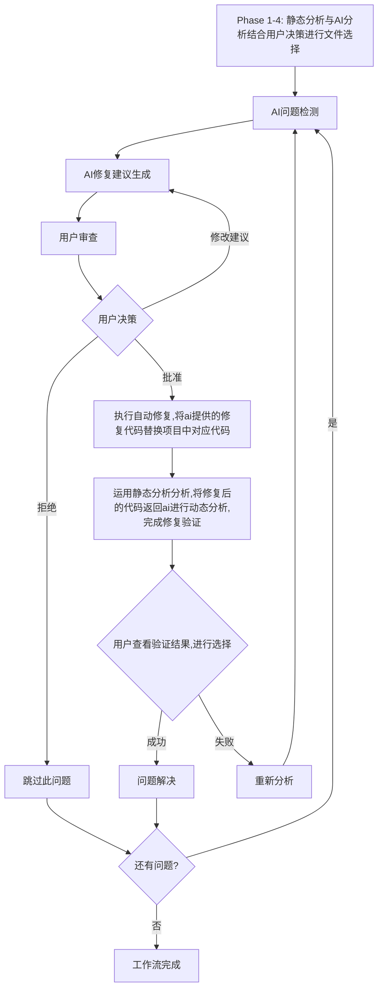

AI驱动的智能项目分析与修复工作流 - 多语言架构设计

📋 项目概览

采用**AI优先的架构设计**，将复杂逻辑简化为AI提示词处理，实现轻量级的智能项目分析与修复系统。核心思路：将项目结构和重点信息发送给AI，让AI和用户决定分析哪些文件，AI返回固定格式的结果，解析后执行相应操作，并支持完整的AI修复工作流。

🎯 核心目标

1. **AI驱动**: 将文件选择、问题分析、修复建议、自动修复等复杂决策交给AI处理
2. **简化架构**: 最小化代码复杂度，最大化AI能力利用
3. **用户协作**: AI提供分析建议，用户做出最终决策，支持反馈循环
4. **固定格式**: AI返回结构化JSON结果，便于程序解析和自动化执行
5. **交互式体验**: 支持实时对话和渐进式分析
6. **成本控制**: 通过智能提示词设计优化token使用
7. **多语言支持**: 支持Python、JavaScript、Java、Go、C++等多种编程语言
8. **完整修复工作流**: 从问题发现到自动修复再到验证的完整闭环

🏗️ 简化架构设计

**核心理念**: AI能做的事情都交给AI，程序只负责：
- 项目结构扫描和数据收集
- 提示词构建和AI调用
- 结果解析和执行
- 用户交互和状态管理

**Phase 1-4 工作流程**:
1. 静态项目分析 → 2. AI项目分析 → 3. 用户决策 → 4. 文件选择 → 5. 进入AI修复工作流

**详细说明**:
- **静态项目分析**: 使用多语言静态分析工具扫描项目，发现代码问题
- **AI项目分析**: AI基于静态分析结果和项目结构，智能选择需要分析的重点文件
- **用户决策**: 用户查看AI的文件选择建议，进行确认或修改
- **文件选择**: 确定最终要分析的文件列表，为AI修复工作流做准备

🔄 **Phase 5: AI修复工作流** (新增)

**完整修复工作流设计**:
```
Phase 4完成后 → AI发现问题 → AI修复建议 → 用户反馈 → 自动修复 → 验证 → 循环/结束
```

**详细工作流程**:
1. **AI问题发现**: 基于静态分析和AI选择的文件，结合用户建议，让AI深度发现问题
2. **AI修复建议**: AI给出具体的修复建议和代码
3. **用户审查**: 用户查看修复建议，给出自己的建议和修改
4. **建议优化**: 结合用户反馈，让AI重新给出修复建议或确认建议
5. **自动修复**: Agent自动解析固定格式的修复建议并执行修复
6. **修复验证**: 修复完成后进行验证，确保问题解决且无新问题
7. **循环处理**: 若仍有问题，返回AI发现问题步骤；若无问题，结束修复流程

🔄 **交互式功能特性**

1. **AI对话决策**: AI分析项目并建议分析哪些文件
2. **用户最终确认**: 用户可以修改AI的建议或提供额外信息
3. **实时对话**: 分析过程中可以与AI进行实时对话
4. **渐进式分析**: 支持分步骤的分析和确认
5. **修复反馈循环**: 用户可以对AI修复建议提出修改意见
6. **多轮迭代**: 支持多轮AI-用户交互直到满意为止

🌍 **多语言支持特性**

**支持的编程语言**:
- **Python**: 完整支持，包含AST分析、Pylint、Flake8、Bandit
- **JavaScript/TypeScript**: ESLint、TypeScript编译器分析
- **Java**: SpotBugs、Checkstyle、PMD集成
- **Go**: go vet、golint、staticcheck分析
- **C/C++**: Clang-tidy、Cppcheck分析
- **通用**: 文本模式分析，支持任意文本文件

**语言特定功能**:
- 语言特定的AST解析器
- 语言感知的复杂度计算
- 语言特定的静态分析工具集成
- 多语言混合项目支持

---

📊 简化任务分解

**Phase 0: 核心数据结构 (已完成)**

T001: 项目分析数据结构 ✅
- 文件: src/tools/project_analysis_types.py
- 状态: 已完成
- 功能: 基础数据类定义

T002: 项目分析配置管理 ✅
- 文件: config/project_analysis_config.yaml
- 状态: 已完成
- 功能: 配置文件和加载器

T003: Logger模块扩展 ✅
- 文件: src/utils/logger.py
- 状态: 已完成
- 功能: 项目分析日志

**Phase 1: 静态项目分析**

T004: 创建多语言静态分析执行器

- 文件: src/tools/multilang_static_analyzer.py
- 任务描述: 执行多语言静态分析，扫描项目发现代码问题
- 验收标准:
    - 支持Python、JavaScript、Java、Go、C++等多种语言
    - 集成AST、Pylint、Flake8、Bandit、ESLint等工具
    - 统一的问题格式输出
    - 代码质量、安全漏洞、复杂度分析
    - 生成静态分析报告

T005: 创建静态分析结果聚合器

- 文件: src/tools/static_analysis_aggregator.py
- 任务描述: 聚合多个静态分析工具的结果，为AI分析提供数据
- 验收标准:
    - 整合不同工具的分析结果
    - 问题去重和优先级排序
    - 生成统一的问题摘要
    - 按文件和严重程度分类
    - 提供文件问题密度统计

**Phase 2: AI项目分析**

T006: 创建AI文件选择器

- 文件: src/tools/ai_file_selector.py
- 任务描述: AI基于静态分析结果和项目结构，智能选择需要重点分析的文件
- 验收标准:
    - 分析项目结构和依赖关系
    - 评估文件重要性和复杂度
    - 结合静态分析问题密度
    - 生成文件优先级排序
    - 支持用户需求输入和偏好设置

T007: 创建AI项目分析提示词管理器

- 文件: src/prompts/ai_project_analysis.py
- 任务描述: 创建AI项目分析的提示词模板和管理
- 验收标准:
    - 项目结构分析提示词
    - 文件重要性评估提示词
    - 用户需求理解提示词
    - 固定JSON响应格式要求
    - Token优化设计和上下文管理

T008: 创建AI分析响应解析器

- 文件: src/tools/ai_analysis_parser.py
- 任务描述: 解析AI返回的项目分析响应
- 验收标准:
    - JSON格式验证和解析
    - 文件选择结果结构化
    - 置信度和优先级评估
    - 错误处理和重试机制
    - 分析结果排序和过滤

**Phase 3: 用户决策与文件选择**

T009: 创建交互式决策界面

- 文件: src/tools/interactive_decision.py
- 任务描述: 提供用户对AI文件选择建议的交互式决策界面
- 验收标准:
    - 展示AI文件选择建议和理由
    - 支持用户查看和修改选择
    - 提供文件预览和问题摘要
    - 支持批量选择和单独调整
    - 实时更新选择统计

T010: 创建文件选择确认器

- 文件: src/tools/file_selection_confirm.py
- 任务描述: 确认最终文件选择，为修复工作流做准备
- 验收标准:
    - 生成最终选择的文件列表
    - 记录用户决策历史
    - 计算分析工作量和预估时间
    - 生成文件选择摘要报告
    - 支持选择结果导出和导入

**Phase 5: AI修复工作流**

T011: 创建AI修复工作流协调器

- 文件: src/tools/ai_fix_workflow_coordinator.py
- 任务描述: 协调整个AI修复工作流程，管理状态转换和数据流
- 验收标准:
    - 工作流状态管理（问题发现→修复建议→用户反馈→自动修复→验证）
    - 多轮迭代支持，允许修复失败时重新开始
    - 会话持久化和恢复
    - 错误处理和回滚机制
    - 进度跟踪和日志记录

T012: 创建多语言静态分析协调器

- 文件: src/tools/multilang_static_coordinator.py
- 任务描述: 扩展静态分析支持多种编程语言
- 验收标准:
    - Python: AST、Pylint、Flake8、Bandit集成
    - JavaScript/TypeScript: ESLint、TypeScript编译器
    - Java: SpotBugs、Checkstyle、PMD集成
    - Go: go vet、golint、staticcheck
    - C/C++: Clang-tidy、Cppcheck
    - 语言自动检测和工具选择
    - 统一的问题格式输出

T013: 创建AI问题检测器

- 文件: src/tools/ai_problem_detector.py
- 任务描述: 基于静态分析结果和文件内容，让AI深度发现问题
- 验收标准:
    - 结合静态分析结果和文件重要性进行AI分析
    - 支持用户需求输入和偏好设置
    - 多语言代码理解能力
    - 要求ai返回结构化的问题检测结果方便解析
    - 置信度和优先级评估

T014: 创建AI修复建议生成器

- 文件: src/tools/ai_fix_suggestion_generator.py
- 任务描述: 为检测到的问题生成具体的修复建议和代码
- 验收标准:
    - 基于问题描述让ai生成修复代码
    - 提供修复说明和推理过程
    - 评估修复风险和副作用
    - 支持多种修复方案对比
    - 要求ai固定JSON格式输出便于解析

T015: 创建用户反馈处理器

- 文件: src/tools/user_feedback_processor.py
- 任务描述: 处理用户对修复建议的反馈和修改意见
- 验收标准:
    - 支持用户接受、拒绝、修改修复建议
    - 记录用户反馈历史和偏好
    - 将用户修改整合到新的AI请求中
    - 支持批量反馈处理
    - 反馈效果统计和分析

T016: 创建自动修复执行器

- 文件: src/tools/auto_fix_executor.py
- 任务描述: 解析AI修复建议并自动应用到代码文件
- 验收标准:
    - 解析固定格式的修复建议
    - 安全的代码修改（创建备份）
    - 精确的行级代码替换
    - 修改前后对比记录
    - 回滚机制支持

T017: 创建修复验证器

- 文件: src/tools/fix_verifier.py
- 任务描述: 验证修复效果，确保问题解决且无新问题
- 验收标准:
    - 重新运行静态分析验证原问题是否解决
    - 检测修复是否引入新问题
    - 代码质量改进评估
    - 修复成功率统计
    - 失败修复的重新分析触发

**Phase 6: 用户接口**

T018: 创建CLI交互式接口

- 文件: src/interfaces/interactive_cli.py
- 任务描述: 提供命令行的交互式分析和修复接口
- 验收标准:
    - 交互式命令行界面
    - 实时对话显示
    - 进度指示器
    - 结果输出格式化
    - 修复工作流命令支持

T019: 创建Web交互式界面

- 文件: web/templates/interactive_analysis.html, web/static/js/interactive_analysis.js
- 任务描述: 提供Web界面的交互式分析和修复
- 验收标准:
    - 实时对话界面
    - 项目结构可视化
    - 分析进度展示
    - 决策确认界面
    - 修复建议编辑器
    - 修复结果对比显示

---

🎯 核心组件设计

**Phase 1-4 完整流程**:
```python
# Phase 1: 静态项目分析
analyzer = MultilangStaticAnalyzer()
static_results = analyzer.analyze_project(project_path)

aggregator = StaticAnalysisAggregator()
aggregated_results = aggregator.aggregate_results(static_results)

# Phase 2: AI项目分析
selector = AIFileSelector()
prompt_manager = AIProjectAnalysisPromptManager()
prompt = prompt_manager.build_analysis_prompt(aggregated_results, user_requirements)

ai_response = selector.analyze_project(prompt)

parser = AIAnalysisParser()
file_recommendations = parser.parse_ai_response(ai_response)

# Phase 3: 用户决策与文件选择
decision_interface = InteractiveDecision()
user_decisions = decision_interface.present_recommendations(file_recommendations)

confirmator = FileSelectionConfirm()
final_files = confirmator.confirm_selection(user_decisions, aggregated_results)

# Phase 4: 进入AI修复工作流
# final_files 现在可以用于 Phase 5: AI修复工作流
```

**AI修复工作流流程**:
```python
# Phase 5: AI修复工作流
import asyncio

async def run_fix_workflow():
    workflow = AIFixWorkflowCoordinator()

    # 1. 启动修复工作流
    session = await workflow.start_fix_workflow(
        project_path="/path/to/project",
        user_requirements="优化代码质量，修复安全漏洞",
        selected_files=["src/services/user.py", "src/utils/helpers.js"]
    )

    # 2. AI问题检测
    findings = await workflow.get_ai_findings()
    # 返回发现的问题列表

    # 3. 生成修复建议
    suggestions = await workflow.generate_fix_suggestions(
        selected_findings=["finding_1", "finding_2"]
    )
    # 返回具体的修复建议

    # 4. 处理用户反馈
    user_feedbacks = [
        {
            "suggestion_id": "suggestion_1",
            "decision": "approve",  # approve/reject/modify
            "comment": "这个修复很好",
            "modified_suggestion": {...}  # 如果decision为modify
        }
    ]
    result = await workflow.process_user_feedback(user_feedbacks)

    # 5. 自动修复和验证
    # 自动执行修复建议并验证结果
    return result

# 执行修复工作流
result = asyncio.run(run_fix_workflow())
```

**AI响应JSON格式 - 文件选择**:
```json
{
  "analysis_summary": "项目包含15个Python文件，主要集中在业务逻辑层...",
  "recommended_files": [
    {
      "file_path": "src/services/user_service.py",
      "priority": "high",
      "reason": "核心业务逻辑，包含多个复杂函数",
      "estimated_tokens": 2500
    }
  ],
  "analysis_focus": [
    "代码复杂度分析",
    "潜在bug检测"
  ],
  "confidence": 0.85
}
```

**AI响应JSON格式 - 问题检测**:
```json
{
  "detected_issues": [
    {
      "issue_id": "issue_001",
      "file_path": "src/services/user_service.py",
      "line": 45,
      "issue_type": "security_vulnerability",
      "severity": "high",
      "description": "SQL注入漏洞风险",
      "code_snippet": "query = f'SELECT * FROM users WHERE id = {user_id}'",
      "confidence": 0.92,
      "reasoning": "使用字符串格式化构建SQL查询存在注入风险"
    }
  ],
  "overall_confidence": 0.88,
  "analysis_summary": "发现3个高风险安全问题，建议立即修复"
}
```

**AI响应JSON格式 - 修复建议**:
```json
{
  "fix_suggestions": [
    {
      "suggestion_id": "fix_001",
      "issue_id": "issue_001",
      "file_path": "src/services/user_service.py",
      "line": 45,
      "original_code": "query = f'SELECT * FROM users WHERE id = {user_id}'",
      "suggested_code": "query = 'SELECT * FROM users WHERE id = %s'",
      "explanation": "使用参数化查询防止SQL注入",
      "reasoning": "参数化查询是防止SQL注入的标准做法",
      "confidence": 0.95,
      "side_effects": [
        "需要确保数据库连接器支持参数化查询"
      ],
      "alternatives": [
        {
          "approach": "使用ORM",
          "code": "User.objects.get(id=user_id)",
          "pros": "更安全，更易维护",
          "cons": "需要引入ORM依赖"
        }
      ]
    }
  ]
}
```

---

🎯 任务优先级

**高优先级 (核心功能)**:
- T004-T006: AI文件选择器
- T007-T008: AI分析执行器
- T009-T010: 交互式工作流
- T011-T017: AI修复工作流 (新增重点)

**中优先级 (用户界面)**:
- T018: CLI交互式接口
- T019: Web交互式界面

**低优先级 (增强功能)**:
- 测试、文档、优化

**特殊说明**: T011-T017 (AI修复工作流) 是本次迭代的核心重点，实现了完整的从问题发现到自动修复的闭环。

---

🔄 **完整的AI修复工作流架构图**



---

📊 预期交付成果

1. **AI驱动的智能项目分析与修复系统**
   - 完整的Phase 1-4项目分析功能
   - 新增Phase 5 AI修复工作流

2. **多语言支持的分析引擎**
   - Python、JavaScript、Java、Go、C++支持
   - 语言特定的静态分析工具集成
   - 统一的问题格式和修复建议

3. **交互式用户界面 (CLI + Web)**
   - 实时AI对话界面
   - 修复建议编辑器
   - 修复结果对比显示
   - 工作流进度跟踪

4. **完整的AI修复闭环系统**
   - AI问题检测与修复建议
   - 用户反馈与多轮迭代
   - 自动修复执行与验证
   - 失败回滚与重新分析

5. **用户决策支持系统**
   - AI建议的可视化展示
   - 用户偏好学习与记忆
   - 批量操作与历史记录

**架构优势**:
- **AI优先**: 将复杂决策交给AI，程序负责执行
- **用户控制**: 关键决策点由用户确认，保证安全性
- **多轮迭代**: 支持反馈循环，直到满意为止
- **多语言**: 统一接口支持多种编程语言
- **自动化**: 从检测到修复的全流程自动化
- **可验证**: 每个修复都有验证机制
- **可回滚**: 支持备份和回滚，确保安全性

这个设计将复杂的逻辑交给AI处理，程序主要负责数据收集、提示词构建、结果解析、用户交互和自动化执行，大大降低了代码复杂度，提高了系统的灵活性和智能化程度，同时实现了完整的代码修复闭环。