# Fix_agent系统架构设计文档


## 1. 系统总体架构图


## 2. 模块依赖关系图


## 3. 数据流图

### 3.1 整体数据流


### 3.2 /workflow命令完整执行序列


### 3.3 多Agent协作时序图


### 3.4 工具调用序列图


## 4. 核心模块架构设计

### 4.1 Agent核心类继承体系（修正版）

```mermaid
classDiagram
    class BaseAgent {
        <<abstract>>
        +agent_id: str
        +name: str
        +agent_type: AgentType
        +config: AgentConfig
        +message_handler: MessageHandler
        +state_manager: AgentStateManager

        +perception_module: PerceptionModule
        +decision_module: DecisionModule
        +execution_module: ExecutionModule

        +start() bool
        +stop() bool
        +handle_message(message: Message) MessageResponse
        +get_status() AgentStatus
        #process_task(task: Task) TaskResult
    }

    class PerceptionModule {
        +tool_registry: ToolRegistry
        +context_manager: ContextManager
        +data_collector: DataCollector

        +perceive_environment() EnvironmentState
        +collect_data(data_sources: List[DataSource]) CollectedData
        +analyze_context() ContextAnalysis
        +update_perception(new_data: Any) None
    }

    class DecisionModule {
        +llm_reasoner: LLMReasoner
        +rule_engine: RuleEngine
        +decision_history: DecisionHistory

        +analyze_situation(context: SituationContext) SituationAnalysis
        +make_decision(analysis: SituationAnalysis) Decision
        +plan_execution(decision: Decision) ExecutionPlan
        +evaluate_confidence(decision: Decision) ConfidenceScore
    }

    class ExecutionModule {
        +tool_executor: ToolExecutor
        +action_coordinator: ActionCoordinator
        +result_validator: ResultValidator

        +execute_plan(plan: ExecutionPlan) ExecutionResult
        +coordinate_actions(actions: List[Action]) List[ActionResult]
        +validate_outcome(results: List[ActionResult]) ValidationResult
        +handle_execution_failure(failure: ExecutionFailure) RecoveryAction
    }

    %% 协调层Agent - 只负责协调，不执行具体业务逻辑
    class ManagerAgent {
        +workflow_orchestrator: WorkflowOrchestrator
        +task_scheduler: TaskScheduler
        +agent_registry: AgentRegistry
        +resource_manager: ResourceManager

        +coordinate_workflow(workflow_request: WorkflowRequest) WorkflowResult
        +assign_task(task: Task) AgentAssignment
        +monitor_execution() ExecutionStatus
        +handle_exceptions(exception: WorkflowException) ExceptionResolution
    }

    class VerifierAgent {
        +verification_orchestrator: VerificationOrchestrator
        +result_aggregator: ResultAggregator
        +quality_evaluator: QualityEvaluator

        +coordinate_verification(verification_request: VerificationRequest) VerificationResult
        +aggregate_verification_results(results: List[VerificationResult]) AggregatedResult
        +evaluate_quality(results: AggregatedResult) QualityAssessment
    }

    %% 分析层Agent - 专门负责问题感知和初步分析
    class AnalyzerAgent {
        +problem_detector: ProblemDetector
        +scope_evaluator: ScopeEvaluator
        +impact_analyzer: ImpactAnalyzer

        +detect_problems(project_context: ProjectContext) List[Problem]
        +evaluate_scope(problems: List[Problem]) ScopeAssessment
        +analyze_impact(problems: List[Problem]) ImpactAnalysis
        +prioritize_problems(problems: List[Problem]) PrioritizedProblems
    }

    %% 专业层Agent - 专门负责深度分析和修复执行
    class SpecialistAgent {
        +domain: DomainType
        +domain_analyzer: DomainAnalyzer
        +solution_generator: SolutionGenerator
        +fix_executor: FixExecutor

        +deep_analysis(problem: DomainProblem) DeepAnalysisResult
        +generate_solution(analysis: DeepAnalysisResult) Solution
        +execute_fix(solution: Solution) FixResult
        +validate_fix(fix_result: FixResult) FixValidation
    }

    %% 支持层Agent - 提供知识管理和报告功能
    class KnowledgeAgent {
        +knowledge_base: KnowledgeBase
        +learning_engine: LearningEngine
        +experience_manager: ExperienceManager

        +store_experience(experience: Experience) bool
        +retrieve_knowledge(query: KnowledgeQuery) Knowledge
        +learn_from_results(results: List[Result]) LearningInsights
        +update_knowledge_base(insights: LearningInsights) bool
    }

    class ReportAgent {
        +report_generator: ReportGenerator
        +insight_extractor: InsightExtractor
        +visualization_engine: VisualizationEngine

        +generate_workflow_report(workflow_data: WorkflowData) WorkflowReport
        +extract_insights(results: List[Result]) List[Insight]
        +create_visualizations(data: ReportData) Visualizations
    }

    %% Agent继承关系
    BaseAgent <|-- ManagerAgent
    BaseAgent <|-- AnalyzerAgent
    BaseAgent <|-- SpecialistAgent
    BaseAgent <|-- VerifierAgent
    BaseAgent <|-- KnowledgeAgent
    BaseAgent <|-- ReportAgent

    %% 专业Agent子类
    SpecialistAgent <|-- ArchitectAgent
    SpecialistAgent <|-- LogicAgent
    SpecialistAgent <|-- PerformanceAgent
    SpecialistAgent <|-- SecurityAgent
    SpecialistAgent <|-- TestAgent

    %% 专业Agent具体实现
    class ArchitectAgent {
        +architecture_analyzer: ArchitectureAnalyzer
        +design_validator: DesignValidator
        +pattern_detector: PatternDetector

        +analyze_architecture(project: Project) ArchitectureAnalysis
        +validate_design_constraints(design: Design) ValidationResults
        +suggest_improvements(analysis: ArchitectureAnalysis) ImprovementSuggestions
    }

    class LogicAgent {
        +logic_analyzer: LogicAnalyzer
        +flow_validator: FlowValidator
        +business_rule_checker: BusinessRuleChecker

        +analyze_business_logic(code: Code) LogicAnalysis
        +validate_control_flows(flows: List[ControlFlow]) ValidationResult
        +check_business_rules(rules: List[BusinessRule]) ComplianceResult
    }

    class PerformanceAgent {
        +performance_profiler: PerformanceProfiler
        +bottleneck_analyzer: BottleneckAnalyzer
        +optimization_recommender: OptimizationRecommender

        +profile_performance(code: Code) PerformanceProfile
        +analyze_bottlenecks(profile: PerformanceProfile) BottleneckAnalysis
        +recommend_optimizations(analysis: BottleneckAnalysis) OptimizationPlan
    }

    class SecurityAgent {
        +vulnerability_scanner: VulnerabilityScanner
        +security_analyzer: SecurityAnalyzer
        +compliance_checker: ComplianceChecker

        +scan_vulnerabilities(code: Code) VulnerabilityReport
        +analyze_security_threats(threats: List[Threat]) ThreatAnalysis
        +check_compliance(standards: List[SecurityStandard]) ComplianceReport
    }

    class TestAgent {
        +test_generator: TestGenerator
        +coverage_analyzer: CoverageAnalyzer
        +quality_assessor: QualityAssessor

        +generate_comprehensive_tests(code: Code) TestSuite
        +analyze_coverage(tests: TestSuite) CoverageReport
        +assess_test_quality(tests: TestSuite) QualityAssessment
    }

    %% 验证子Agent - 具体执行各类验证
    class VerificationSubAgent {
        <<abstract>>
        +verification_type: VerificationType
        +validation_criteria: ValidationCriteria

        +execute_verification(target: VerificationTarget) VerificationResult
        +validate_criteria(result: VerificationResult) ValidationResult
    }

    VerificationSubAgent <|-- StaticAnalysisVerificationAgent
    VerificationSubAgent <|-- UnitTestVerificationAgent
    VerificationSubAgent <|-- IntegrationTestVerificationAgent
    VerificationSubAgent <|-- SecurityAuditVerificationAgent
    VerificationSubAgent <|-- PerformanceTestVerificationAgent
```



### 4.2 工具接口类图


### 4.3 工作流状态机类图


## 5. 技术选型说明

### 5.1 核心技术栈
- **Python 3.9+**: 主要开发语言，生态丰富
- **LangChain**: LLM集成框架，提供标准化接口
- **asyncio**: 异步编程框架，支持高并发
- **JSON**: 配置文件格式，性能好生态完善

### 5.2 消息队列选择
- **asyncio.Queue**: 基于Python内置队列，轻量级实现
- **支持优先级队列**: 任务优先级管理
- **异步消息传递**: 符合高并发需求

### 5.3 LLM集成
- **Zhipu API**: 主要LLM提供商
- **LangChain集成**: 标准化LLM调用接口
- **多模型支持**: 预留扩展接口

### 5.4 数据存储
- **文件持久化**: JSON格式存储Agent状态
- **配置管理**: JSON配置文件
- **日志系统**: 文件日志存储

### 5.5 静态分析工具集成
- **pylint**: Python代码质量检查
- **flake8**: 代码风格检查
- **bandit**: 安全漏洞检查
- **ast**: Python AST解析

## 6. 接口规范设计

### 6.1 Agent通信接口

```python
from abc import ABC, abstractmethod
from typing import Dict, List, Any, Optional
from dataclasses import dataclass
from enum import Enum

class MessageType(Enum):
    TASK_REQUEST = "task_request"
    TASK_RESPONSE = "task_response"
    STATUS_UPDATE = "status_update"
    ERROR_MESSAGE = "error_message"
    COORDINATION = "coordination"

@dataclass
class Message:
    message_id: str
    sender_id: str
    receiver_id: str
    message_type: MessageType
    payload: Dict[str, Any]
    timestamp: float
    correlation_id: Optional[str] = None

class AgentCommunicationInterface(ABC):
    @abstractmethod
    async def send_message(self, message: Message) -> bool:
        """发送消息到指定Agent"""
        pass

    @abstractmethod
    async def receive_message(self, timeout: float = None) -> Optional[Message]:
        """接收消息"""
        pass

    @abstractmethod
    async def broadcast_message(self, message: Message) -> int:
        """广播消息到所有Agent"""
        pass

    @abstractmethod
    async def get_message_status(self, message_id: str) -> MessageStatus:
        """获取消息状态"""
        pass
```

### 6.2 工具调用接口

```python
@dataclass
class ToolInput:
    tool_id: str
    parameters: Dict[str, Any]
    context: Optional[Dict[str, Any]] = None

@dataclass
class ToolOutput:
    success: bool
    data: Any
    error_message: Optional[str] = None
    execution_time: float = 0.0

class ToolInterface(ABC):
    @abstractmethod
    def get_tool_schema(self) -> ToolSchema:
        """获取工具模式定义"""
        pass

    @abstractmethod
    async def execute(self, input_data: ToolInput) -> ToolOutput:
        """执行工具"""
        pass

    @abstractmethod
    def validate_input(self, input_data: ToolInput) -> ValidationResult:
        """验证输入参数"""
        pass

@dataclass
class ToolSchema:
    name: str
    description: str
    parameters: Dict[str, ParameterSchema]
    required_parameters: List[str]

@dataclass
class ParameterSchema:
    name: str
    type: str
    description: str
    required: bool = True
    default_value: Any = None
```

### 6.3 数据交换格式

```python
from typing import TypedDict, List, Dict, Any, Optional
from datetime import datetime

class TaskData(TypedDict):
    task_id: str
    task_type: str
    priority: int
    assigned_agent: str
    input_data: Dict[str, Any]
    dependencies: List[str]
    created_at: datetime
    deadline: Optional[datetime]

class AnalysisResultData(TypedDict):
    result_id: str
    analysis_type: str
    findings: List[Dict[str, Any]]
    recommendations: List[str]
    confidence_score: float
    metadata: Dict[str, Any]

class FixResultData(TypedDict):
    fix_id: str
    original_code: str
    fixed_code: str
    changes_made: List[str]
    validation_result: Dict[str, Any]
    applied_at: datetime

class VerificationResultData(TypedDict):
    verification_id: str
    fix_id: str
    test_results: Dict[str, Any]
    coverage_report: Dict[str, Any]
    security_scan: Dict[str, Any]
    performance_metrics: Dict[str, Any]
    overall_status: str  # PASSED, FAILED, PARTIAL
```

## 7. 并发处理设计

### 7.1 Agent并发管理
- **异步任务执行**: 使用asyncio管理Agent并发
- **资源池管理**: 限制并发Agent数量
- **死锁检测**: 避免Agent间循环等待
- **负载均衡**: 任务分配优化

### 7.2 消息队列管理
- **优先级队列**: 紧急任务优先处理
- **消息持久化**: 防止消息丢失
- **重试机制**: 失败消息自动重试
- **流量控制**: 防止消息积压

## 8. 上下文管理设计

### 8.1 统一上下文管理器


### 8.2 LangChain集成上下文


## 9. 用户交互界面设计

### 9.1 命令行界面架构


### 9.2 命令系统设计

```mermaid
classDiagram
    class InitCommand {
        +project_scanner: ProjectScanner
        +llm_client: LLMClient

        +execute(args: List[str], context: Context) CommandResult
        +analyze_project(project_path: str) ProjectAnalysis
        +initialize_context(project_info: ProjectInfo) None
    }

    class WorkflowCommand {
        +workflow_engine: WorkflowEngine
        +manager_agent: ManagerAgent

        +execute(args: List[str], context: Context) CommandResult
        +start_workflow(workflow_type: str) None
        +monitor_workflow() WorkflowStatus
    }

    class AgentCommand {
        +agent_manager: AgentManager
        +config_manager: ConfigManager

        +execute(args: List[str], context: Context) CommandResult
        +list_agents() List[AgentInfo]
        +configure_agent(agent_id: str, config: Dict) None
        +show_agent_status(agent_id: str) AgentStatus
    }

    class ModelCommand {
        +llm_manager: LLMManager
        +model_registry: ModelRegistry

        +execute(args: List[str], context: Context) CommandResult
        +list_models() List[ModelInfo]
        +select_model(model_name: str) bool
        +configure_model(config: ModelConfig) None
    }

    class HelpCommand {
        +command_registry: CommandRegistry

        +execute(args: List[str], context: Context) CommandResult
        +show_general_help() None
        +show_command_help(command_name: str) None
        +list_commands() None
    }

    class ExitCommand {
        +cleanup_manager: CleanupManager

        +execute(args: List[str], context: Context) CommandResult
        +save_session_state() None
        +cleanup_resources() None
        +exit_system() None
    }

    BaseCommand <|-- InitCommand
    BaseCommand <|-- WorkflowCommand
    BaseCommand <|-- AgentCommand
    BaseCommand <|-- ModelCommand
    BaseCommand <|-- HelpCommand
    BaseCommand <|-- ExitCommand
```



### 9.3 对话模式设计


## 10. 详细工具定义

### 10.1 感知类工具（环境感知）

```python
# 项目感知工具
class ProjectPerceptionTool(BaseTool):
    """项目结构感知工具"""

    def get_schema(self) -> ToolSchema:
        return ToolSchema(
            name="project_perception",
            description="感知项目结构、依赖、配置等信息",
            parameters={
                "project_path": ParameterSchema(
                    name="project_path",
                    type="string",
                    description="项目路径",
                    required=True
                ),
                "perception_depth": ParameterSchema(
                    name="perception_depth",
                    type="string",
                    description="感知深度：basic/detailed/comprehensive",
                    required=False,
                    default_value="detailed"
                )
            },
            required_parameters=["project_path"]
        )

    async def execute(self, input_data: ToolInput) -> ToolOutput:
        """执行项目感知"""
        project_path = input_data.parameters["project_path"]
        depth = input_data.parameters.get("perception_depth", "detailed")

        # 感知项目结构
        structure = await self._scan_project_structure(project_path, depth)

        # 感知依赖关系
        dependencies = await self._analyze_dependencies(project_path)

        # 感知配置文件
        configurations = await self._detect_configurations(project_path)

        return ToolOutput(
            success=True,
            data={
                "structure": structure,
                "dependencies": dependencies,
                "configurations": configurations,
                "project_type": self._detect_project_type(structure),
                "tech_stack": self._identify_tech_stack(dependencies, configurations)
            }
        )

# 代码感知工具
class CodePerceptionTool(BaseTool):
    """代码感知工具"""

    def get_schema(self) -> ToolSchema:
        return ToolSchema(
            name="code_perception",
            description="感知代码质量、结构、复杂度等信息",
            parameters={
                "file_paths": ParameterSchema(
                    name="file_paths",
                    type="array",
                    description="要感知的文件路径列表",
                    required=True
                ),
                "analysis_types": ParameterSchema(
                    name="analysis_types",
                    type="array",
                    description="分析类型：structure, quality, complexity, patterns",
                    required=False,
                    default_value=["structure", "quality"]
                )
            },
            required_parameters=["file_paths"]
        )

    async def execute(self, input_data: ToolInput) -> ToolOutput:
        """执行代码感知"""
        file_paths = input_data.parameters["file_paths"]
        analysis_types = input_data.parameters.get("analysis_types", ["structure", "quality"])

        results = {}

        for file_path in file_paths:
            file_result = {}

            if "structure" in analysis_types:
                file_result["structure"] = await self._analyze_code_structure(file_path)

            if "quality" in analysis_types:
                file_result["quality"] = await self._analyze_code_quality(file_path)

            if "complexity" in analysis_types:
                file_result["complexity"] = await self._analyze_complexity(file_path)

            if "patterns" in analysis_types:
                file_result["patterns"] = await self._detect_design_patterns(file_path)

            results[file_path] = file_result

        return ToolOutput(success=True, data=results)

# 问题感知工具
class IssuePerceptionTool(BaseTool):
    """问题感知工具"""

    def get_schema(self) -> ToolSchema:
        return ToolSchema(
            name="issue_perception",
            description="感知代码中的问题和缺陷",
            parameters={
                "target": ParameterSchema(
                    name="target",
                    type="string",
                    description="感知目标：file, directory, project",
                    required=True
                ),
                "target_path": ParameterSchema(
                    name="target_path",
                    type="string",
                    description="目标路径",
                    required=True
                ),
                "issue_types": ParameterSchema(
                    name="issue_types",
                    type="array",
                    description="问题类型：bugs, security, performance, style, architecture",
                    required=False,
                    default_value=["bugs", "security", "performance"]
                )
            },
            required_parameters=["target", "target_path"]
        )

    async def execute(self, input_data: ToolInput) -> ToolOutput:
        """执行问题感知"""
        target = input_data.parameters["target"]
        target_path = input_data.parameters["target_path"]
        issue_types = input_data.parameters.get("issue_types", ["bugs", "security", "performance"])

        issues = []

        if "bugs" in issue_types:
            issues.extend(await self._detect_bugs(target, target_path))

        if "security" in issue_types:
            issues.extend(await self._detect_security_issues(target, target_path))

        if "performance" in issue_types:
            issues.extend(await self._detect_performance_issues(target, target_path))

        if "style" in issue_types:
            issues.extend(await self._detect_style_issues(target, target_path))

        if "architecture" in issue_types:
            issues.extend(await self._detect_architecture_issues(target, target_path))

        # 按严重程度分类
        categorized_issues = self._categorize_issues(issues)

        return ToolOutput(
            success=True,
            data={
                "issues": categorized_issues,
                "summary": {
                    "total_count": len(issues),
                    "critical_count": len([i for i in issues if i.severity == "critical"]),
                    "warning_count": len([i for i in issues if i.severity == "warning"]),
                    "info_count": len([i for i in issues if i.severity == "info"])
                }
            }
        )
```

### 10.2 决策类工具（智能分析）

```python
# 问题分析决策工具
class ProblemAnalysisTool(BaseTool):
    """问题分析决策工具"""

    def get_schema(self) -> ToolSchema:
        return ToolSchema(
            name="problem_analysis",
            description="基于感知到的问题进行智能分析和决策",
            parameters={
                "issues": ParameterSchema(
                    name="issues",
                    type="array",
                    description="感知到的问题列表",
                    required=True
                ),
                "project_context": ParameterSchema(
                    name="project_context",
                    type="object",
                    description="项目上下文信息",
                    required=True
                ),
                "analysis_depth": ParameterSchema(
                    name="analysis_depth",
                    type="string",
                    description="分析深度：basic, detailed, comprehensive",
                    required=False,
                    default_value="detailed"
                )
            },
            required_parameters=["issues", "project_context"]
        )

    async def execute(self, input_data: ToolInput) -> ToolOutput:
        """执行问题分析决策"""
        issues = input_data.parameters["issues"]
        project_context = input_data.parameters["project_context"]
        analysis_depth = input_data.parameters.get("analysis_depth", "detailed")

        # LLM分析问题
        analysis_prompt = self._build_analysis_prompt(issues, project_context, analysis_depth)
        llm_analysis = await self.llm_client.generate_response(analysis_prompt)

        # 解析分析结果
        analysis_result = self._parse_analysis_result(llm_analysis)

        # 生成修复建议
        recommendations = await self._generate_recommendations(issues, analysis_result)

        # 评估修复复杂度
        complexity_assessment = self._assess_fix_complexity(issues, recommendations)

        return ToolOutput(
            success=True,
            data={
                "analysis": analysis_result,
                "recommendations": recommendations,
                "complexity_assessment": complexity_assessment,
                "suggested_approach": self._suggest_approach(analysis_result, complexity_assessment)
            }
        )

# 任务规划决策工具
class TaskPlanningTool(BaseTool):
    """任务规划决策工具"""

    def get_schema(self) -> ToolSchema:
        return ToolSchema(
            name="task_planning",
            description="基于分析结果规划修复任务",
            parameters={
                "analysis_result": ParameterSchema(
                    name="analysis_result",
                    type="object",
                    description="问题分析结果",
                    required=True
                ),
                "recommendations": ParameterSchema(
                    name="recommendations",
                    type="array",
                    description="修复建议列表",
                    required=True
                ),
                "resource_constraints": ParameterSchema(
                    name="resource_constraints",
                    type="object",
                    description="资源约束条件",
                    required=False
                )
            },
            required_parameters=["analysis_result", "recommendations"]
        )

    async def execute(self, input_data: ToolInput) -> ToolOutput:
        """执行任务规划决策"""
        analysis_result = input_data.parameters["analysis_result"]
        recommendations = input_data.parameters["recommendations"]
        resource_constraints = input_data.parameters.get("resource_constraints", {})

        # 生成任务分解
        task_breakdown = await self._generate_task_breakdown(recommendations)

        # 评估任务依赖关系
        task_dependencies = self._analyze_task_dependencies(task_breakdown)

        # 优化任务执行顺序
        optimized_sequence = self._optimize_task_sequence(task_breakdown, task_dependencies)

        # 分配专业Agent
        agent_assignments = self._assign_agents_to_tasks(optimized_sequence)

        return ToolOutput(
            success=True,
            data={
                "task_breakdown": task_breakdown,
                "task_dependencies": task_dependencies,
                "execution_sequence": optimized_sequence,
                "agent_assignments": agent_assignments,
                "estimated_duration": self._estimate_duration(optimized_sequence)
            }
        )
```

### 10.3 执行类工具（实际操作）

```python
# 代码修复执行工具
class CodeFixTool(BaseTool):
    """代码修复执行工具"""

    def get_schema(self) -> ToolSchema:
        return ToolSchema(
            name="code_fix",
            description="执行代码修复操作",
            parameters={
                "fix_plan": ParameterSchema(
                    name="fix_plan",
                    type="object",
                    description="修复计划",
                    required=True
                ),
                "backup_enabled": ParameterSchema(
                    name="backup_enabled",
                    type="boolean",
                    description="是否启用备份",
                    required=False,
                    default_value=True
                ),
                "validation_enabled": ParameterSchema(
                    name="validation_enabled",
                    type="boolean",
                    description="是否启用验证",
                    required=False,
                    default_value=True
                )
            },
            required_parameters=["fix_plan"]
        )

    async def execute(self, input_data: ToolInput) -> ToolOutput:
        """执行代码修复"""
        fix_plan = input_data.parameters["fix_plan"]
        backup_enabled = input_data.parameters.get("backup_enabled", True)
        validation_enabled = input_data.parameters.get("validation_enabled", True)

        fix_results = []

        for fix_item in fix_plan["fixes"]:
            result = await self._execute_single_fix(fix_item, backup_enabled)

            if validation_enabled:
                validation = await self._validate_fix(result)
                result["validation"] = validation

            fix_results.append(result)

        return ToolOutput(
            success=True,
            data={
                "fix_results": fix_results,
                "summary": self._generate_fix_summary(fix_results),
                "rollback_info": self._generate_rollback_info(fix_results) if backup_enabled else None
            }
        )

# 测试执行工具
class TestExecutionTool(BaseTool):
    """测试执行工具"""

    def get_schema(self) -> ToolSchema:
        return ToolSchema(
            name="test_execution",
            description="执行各种类型的测试",
            parameters={
                "test_config": ParameterSchema(
                    name="test_config",
                    type="object",
                    description="测试配置",
                    required=True
                ),
                "test_types": ParameterSchema(
                    name="test_types",
                    type="array",
                    description="测试类型：unit, integration, security, performance",
                    required=False,
                    default_value=["unit"]
                )
            },
            required_parameters=["test_config"]
        )

    async def execute(self, input_data: ToolInput) -> ToolOutput:
        """执行测试"""
        test_config = input_data.parameters["test_config"]
        test_types = input_data.parameters.get("test_types", ["unit"])

        test_results = {}

        for test_type in test_types:
            if test_type == "unit":
                test_results[test_type] = await self._run_unit_tests(test_config)
            elif test_type == "integration":
                test_results[test_type] = await self._run_integration_tests(test_config)
            elif test_type == "security":
                test_results[test_type] = await self._run_security_tests(test_config)
            elif test_type == "performance":
                test_results[test_type] = await self._run_performance_tests(test_config)

        return ToolOutput(
            success=True,
            data={
                "test_results": test_results,
                "overall_status": self._evaluate_overall_status(test_results),
                "coverage_report": await self._generate_coverage_report(test_config)
            }
        )
```

### 10.4 工具数据规范

```python
# 工具输入输出数据结构
@dataclass
class ToolCallResult:
    tool_name: str
    success: bool
    data: Dict[str, Any]
    execution_time: float
    error_message: Optional[str] = None
    metadata: Optional[Dict[str, Any]] = None

@dataclass
class PerceptionResult:
    """感知结果数据结构"""
    perceived_data: Dict[str, Any]
    confidence_level: float
    data_quality_score: float
    missing_information: List[str]
    perception_timestamp: datetime

@dataclass
class DecisionResult:
    """决策结果数据结构"""
    decision: str
    reasoning: str
    confidence: float
    alternatives: List[str]
    decision_criteria: Dict[str, Any]
    decision_timestamp: datetime

@dataclass
class ExecutionResult:
    """执行结果数据结构"""
    action_performed: str
    outcome: str
    side_effects: List[str]
    rollback_available: bool
    execution_logs: List[str]
    execution_timestamp: datetime

# Agent间通信数据规范
@dataclass
class AgentMessage:
    sender_agent_id: str
    receiver_agent_id: str
    message_type: str
    payload: Dict[str, Any]
    priority: int
    timestamp: datetime
    correlation_id: str
    requires_response: bool = False
    response_timeout: Optional[float] = None

@dataclass
class TaskAssignment:
    task_id: str
    assigned_agent_id: str
    task_description: str
    task_type: str
    priority: int
    input_data: Dict[str, Any]
    expected_output: Dict[str, str]
    deadline: Optional[datetime]
    dependencies: List[str]
    resources_required: Dict[str, Any]
```

## 11. 错误处理与恢复

### 11.1 错误分类
- **系统错误**: 内存不足、网络故障
- **Agent错误**: LLM调用失败、工具执行错误
- **业务错误**: 任务分配冲突、依赖缺失
- **并发错误**: 死锁、资源竞争、消息丢失

### 11.2 恢复策略
- **自动重试**: 临时错误自动重试
- **降级处理**: 核心功能优先保障
- **状态回滚**: 失败任务状态恢复
- **人工干预**: 复杂问题人工处理
- **并发冲突解决**: 锁机制、事务回滚

### 11.3 并发处理特殊设计


## 12. 可扩展性设计（修正版）

### 12.1 插件化Agent架构


### 12.2 可配置工作流引擎


### 12.3 工具生态系统


### 12.4 扩展点设计

#### 12.4.1 Agent扩展点

```python
# Agent扩展接口
class AgentExtensionPoint:
    """Agent扩展点基类"""

    def on_agent_created(self, agent: BaseAgent) -> None:
        """Agent创建时调用"""
        pass

    def on_task_assigned(self, agent: BaseAgent, task: Task) -> bool:
        """任务分配时调用，返回是否接受任务"""
        return True

    def on_task_completed(self, agent: BaseAgent, task: Task, result: TaskResult) -> None:
        """任务完成时调用"""
        pass

    def on_agent_error(self, agent: BaseAgent, error: Exception) -> ErrorHandlingStrategy:
        """Agent出错时调用"""
        return ErrorHandlingStrategy.RETRY

# 扩展点注册器
class ExtensionPointRegistry:
    def __init__(self):
        self.extension_points: Dict[str, List[AgentExtensionPoint]] = {}

    def register_extension_point(self, point_name: str, extension: AgentExtensionPoint) -> None:
        if point_name not in self.extension_points:
            self.extension_points[point_name] = []
        self.extension_points[point_name].append(extension)

    def trigger_extension_point(self, point_name: str, *args, **kwargs) -> List[Any]:
        results = []
        if point_name in self.extension_points:
            for extension in self.extension_points[point_name]:
                results.append(extension(*args, **kwargs))
        return results
```

#### 12.4.2 工作流扩展点

```python
# 工作流扩展接口
class WorkflowExtensionPoint:
    """工作流扩展点基类"""

    def on_workflow_started(self, workflow: WorkflowDefinition, context: ExecutionContext) -> None:
        """工作流开始时调用"""
        pass

    def on_step_started(self, step: WorkflowStep, context: ExecutionContext) -> bool:
        """步骤开始时调用，返回是否继续执行"""
        return True

    def on_step_completed(self, step: WorkflowStep, result: StepResult, context: ExecutionContext) -> None:
        """步骤完成时调用"""
        pass

    def on_workflow_completed(self, workflow: WorkflowDefinition, result: WorkflowResult, context: ExecutionContext) -> None:
        """工作流完成时调用"""
        pass
```

#### 12.4.3 工具扩展点

```python
# 工具扩展接口
class ToolExtensionPoint:
    """工具扩展点基类"""

    def on_tool_registered(self, tool: BaseTool, metadata: ToolMetadata) -> None:
        """工具注册时调用"""
        pass

    def on_tool_executed(self, tool: BaseTool, input_data: ToolInput, output_data: ToolOutput) -> None:
        """工具执行时调用"""
        pass

    def on_tool_error(self, tool: BaseTool, error: Exception, input_data: ToolInput) -> ErrorHandlingStrategy:
        """工具出错时调用"""
        return ErrorHandlingStrategy.FAIL
```

### 12.5 配置驱动的系统架构


### 12.6 监控和诊断扩展


## 13. 修正后架构的优势

### 13.1 **清晰的职责分工**
- **协调层Agent**: 只负责协调，不执行具体业务逻辑
- **分析层Agent**: 专门负责问题感知和初步分析
- **专业层Agent**: 专门负责深度分析和修复执行
- **支持层Agent**: 提供知识管理和报告功能

### 13.2 **统一通信机制**
- 所有Agent间通过消息队列异步通信
- 标准化的消息格式和协议
- 支持优先级和可靠性保障

### 13.3 **模块化工具系统**
- 按照感知-决策-执行模型分类工具
- 统一的工具注册和发现机制
- 版本管理和兼容性控制

### 13.4 **强大的扩展能力**
- 插件化Agent架构，支持动态加载
- 可配置工作流引擎，支持自定义流程
- 工具生态系统，支持第三方工具集成
- 扩展点机制，支持功能定制

### 13.5 **完善的监控体系**
- 全链路日志追踪
- 实时性能监控
- 健康检查和告警
- 诊断和问题定位

---

**架构设计修正完成，现在具备了良好的合理性、一致性和可扩展性。确认后回复"架构已审批，进入阶段3"。**