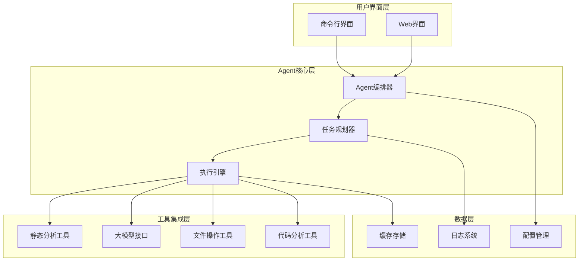
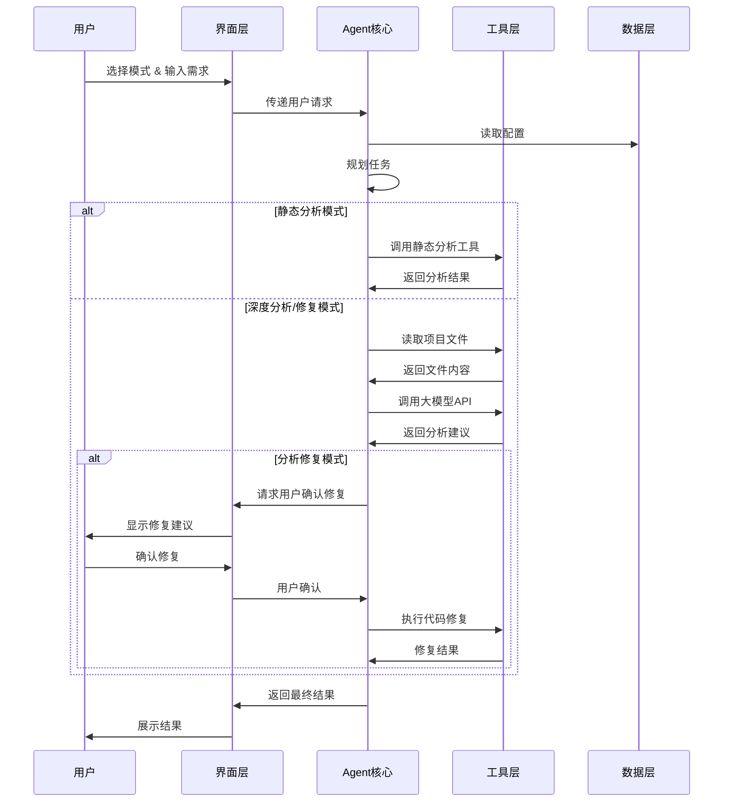

# DESIGN_AI_Defect_Detection_System.md

## 系统架构设计

### 总体架构概述
基于LangChain框架的AI Agent系统，采用模块化设计，支持命令行和Web双界面交互。

### 系统架构图



### 核心数据流图



## 核心模块设计

### 1. Agent编排器 (AgentOrchestrator)
**职责**: 统一协调各个模块，管理用户会话
**核心功能**:
- 接收用户输入和模式选择
- 调用相应的处理流程
- 管理对话上下文
- 协调工具调用

### 2. 任务规划器 (TaskPlanner)
**职责**: 根据用户需求制定具体执行计划
**核心功能**:
- 分析用户需求类型
- 确定需要读取的文件
- 制定分析步骤
- 决策工具调用顺序

### 3. 执行引擎 (ExecutionEngine)
**职责**: 执行具体的分析和修复任务
**核心功能**:
- 调用静态分析工具
- 管理大模型API调用
- 执行代码修复操作
- 处理用户确认流程

### 4. 工具集成模块 (ToolIntegration)

#### 静态分析工具 (StaticAnalyzer)
- **语法分析**: Python ast模块
- **代码质量**: pylint, flake8
- **安全检查**: bandit
- **复杂度分析**: mccabe

#### 大模型接口 (LLMInterface)
- **API适配**: 支持多种LLM API
- **Prompt管理**: 针对不同任务的prompt模板
- **上下文管理**: 维护对话历史
- **错误处理**: API调用异常处理

#### 文件操作工具 (FileOperations)
- **项目扫描**: 识别项目结构和文件类型
- **智能读取**: 根据需求选择相关文件
- **代码解析**: 提取代码关键信息
- **备份管理**: 修复前的文件备份

#### 代码分析工具 (CodeAnalyzer)
- **依赖分析**: 分析模块依赖关系
- **模式识别**: 识别常见代码模式
- **问题定位**: 精确定位代码问题
- **影响评估**: 评估修改影响范围

## 技术选型说明

### 核心框架
- **LangChain**: AI Agent开发框架，提供工具调用和链式处理能力
- **选择理由**: 成熟的Agent框架，丰富的工具集成，活跃的社区支持

### Web框架
- **Flask**: 轻量级Web框架
- **选择理由**: 简单易用，快速开发，符合"简易前端"需求

### 静态分析工具
- **Python生态**: pylint, flake8, bandit, ast
- **选择理由**: 成熟稳定，功能全面，Python原生支持

### 前端技术
- **HTML/CSS/JavaScript**: 基础Web技术
- **选择理由**: 无需复杂构建流程，易于维护

## 项目目录结构

```
AIDefectDetector/
├── src/
│   ├── agent/
│   │   ├── __init__.py
│   │   ├── orchestrator.py      # Agent编排器
│   │   ├── planner.py           # 任务规划器
│   │   └── executor.py          # 执行引擎
│   ├── tools/
│   │   ├── __init__.py
│   │   ├── static_analyzer.py   # 静态分析工具
│   │   ├── llm_interface.py     # 大模型接口
│   │   ├── file_operations.py   # 文件操作工具
│   │   └── code_analyzer.py     # 代码分析工具
│   ├── interfaces/
│   │   ├── __init__.py
│   │   ├── cli.py              # 命令行界面
│   │   └── web.py              # Web界面
│   ├── utils/
│   │   ├── __init__.py
│   │   ├── config.py           # 配置管理
│   │   ├── logger.py           # 日志系统
│   │   └── cache.py            # 缓存管理
│   └── prompts/
│       ├── static_analysis.py  # 静态分析提示词
│       ├── deep_analysis.py    # 深度分析提示词
│       └── fix_suggestion.py   # 修复建议提示词
├── web/
│   ├── static/
│   │   ├── css/
│   │   ├── js/
│   │   └── images/
│   └── templates/
│       ├── index.html
│       ├── analysis.html
│       └── fix.html
├── tests/
│   ├── test_agent/
│   ├── test_tools/
│   └── test_interfaces/
├── config/
│   ├── default.yaml
│   └── user_config.example.yaml
├── main.py                     # 主入口文件
├── requirements.txt
└── README.md
```

## 关键设计决策

### 1. 模式切换策略
- **状态机设计**: 明确三种模式的状态转换
- **接口统一**: 不同模式使用相同的底层工具
- **上下文隔离**: 各模式间的分析结果独立存储

### 2. 文件读取策略
- **启发式算法**: 根据文件扩展名和内容判断相关性
- **依赖图分析**: 基于import关系确定核心文件
- **用户引导**: 在不确定时询问用户确认

### 3. 修复安全机制
- **备份策略**: 修复前自动创建备份
- **差异展示**: 清晰显示修改前后对比
- **分步确认**: 重要修改需要用户逐步确认

### 4. 性能优化策略
- **缓存机制**: 缓存分析结果和LLM响应
- **异步处理**: 大文件分析采用异步处理
- **批处理**: 相关文件批量分析

## 安全性设计

### 1. API密钥管理
- **本地存储**: API密钥仅存储在用户本地
- **加密保护**: 使用加密方式存储敏感信息
- **权限控制**: 限制文件访问权限

### 2. 代码执行安全
- **沙箱环境**: 代码测试在隔离环境中进行
- **权限限制**: 限制文件系统访问权限
- **审计日志**: 记录所有修改操作

## 扩展性设计

### 1. 插件架构
- **工具插件**: 支持新的分析工具集成
- **语言支持**: 可扩展支持更多编程语言
- **模型适配**: 支持新的大模型API

### 2. 配置灵活性
- **YAML配置**: 使用YAML格式配置文件
- **环境变量**: 支持环境变量覆盖配置
- **用户自定义**: 允许用户自定义分析规则