# Fix Agent 系统架构深度分析文档

## 项目概述

**Fix Agent** 是一个基于LangChain 1.0和Deepagents框架构建的智能代码缺陷修复助手。该项目采用创新的**三层子代理协作架构**，实现了从代码缺陷检测、自动修复到效果验证的完整AI驱动工作流。项目当前版本为1.0.6，代表了现代AI Agent开发的最佳实践。

### 核心特性

- **🤖 三层子代理协作**: 缺陷分析→代码修复→修复验证的专业化分工链路
- **🧠 分层记忆系统**: 工作记忆、语义记忆、情节记忆的智能化记忆架构
- **🔒 多级安全防护**: Human-in-the-loop机制和多层次安全检查
- **🛠️ 统一工具链**: 集成多语言静态分析和代码质量工具
- **📊 实时监控**: 性能监控、日志记录和错误追踪系统
- **🎯 智能缺陷聚合**: 基于语义相似度的缺陷聚类和优先级分析

## 1. 系统架构设计

### 1.1 整体架构概览

```mermaid
graph TB
    subgraph "用户交互层"
        CLI[命令行界面]
        WEB[Web界面]
    end

    subgraph "中间件管道系统"
        subgraph "外层监控层"
            PM[性能监控中间件]
            LOG[日志记录中间件]
        end

        subgraph "中间增强层"
            CE[上下文增强中间件]
            LM[分层记忆中间件]
        end

        subgraph "内层控制层"
            SEC[安全检查中间件]
            SHELL[Shell工具中间件]
        end
    end

    subgraph "Agent核心层"
        MAIN[主协调代理]
        DEFECT[缺陷分析代理]
        FIXER[代码修复代理]
        VALID[修复验证代理]
    end

    subgraph "工具集成层"
        subgraph "代码分析工具"
            AC[analyze_code_defects]
            AGG[aggregate_defects]
            CC[analyze_code_complexity]
        end

        subgraph "错误检测工具"
            COMP[compile_project]
            RUN[run_and_monitor]
            TEST[run_tests_with_error_capture]
        end

        subgraph "项目工具"
            EXP[explore_project_structure]
            FMT[format_code_professional]
            GEN[generate_validation_tests]
        end

        subgraph "网络工具"
            HTTP[http_request]
            SEARCH[web_search]
        end
    end

    subgraph "存储层"
        FS[文件系统]
        MEM[记忆存储]
        CONFIG[配置管理]
    end

    CLI --> MAIN
    WEB --> MAIN
    MAIN --> DEFECT
    MAIN --> FIXER
    MAIN --> VALID

    DEFECT --> AC
    DEFECT --> AGG
    DEFECT --> CC

    FIXER --> FMT
    FIXER --> EXP
    FIXER --> HTTP

    VALID --> TEST
    VALID --> RUN
    VALID --> COMP

    PM --> FS
    LOG --> MEM
    CE --> MEM
    LM --> MEM
    SEC --> FS
    SHELL --> FS
```

### 1.2 中间件管道架构

项目采用**分层中间件管道架构**，这是一个精心设计的四层架构，为AI代码缺陷修复工具提供了企业级的可扩展性、安全性和可维护性。

#### 架构概览图

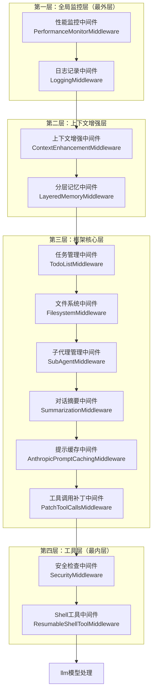

#### 第一层：全局监控层（最外层）

**性能监控中间件 (PerformanceMonitorMiddleware)**：
- **核心功能**: 实时系统资源监控、性能指标收集、Token使用量统计
- **数据结构**: 使用PerformanceRecord记录响应时间、CPU/内存使用、工具调用统计
- **监控机制**: 后台线程持续监控系统状态，支持时间窗口分析
- **性能优化**: 提供性能瓶颈识别、资源使用优化建议

**日志记录中间件 (LoggingMiddleware)**：
- **日志分类**: 对话日志、工具调用日志、性能日志、错误日志
- **存储格式**: JSON结构化日志，支持时间戳、会话ID追踪
- **管理机制**: 日志轮转和清理，按会话、类型分类存储
- **监控支持**: 提供全面的操作审计跟踪

#### 第二层：上下文增强层

**上下文增强中间件 (ContextEnhancementMiddleware)**：
- **项目分析**: 智能分析项目结构、识别编程语言、检测框架
- **对话模式**: 分析用户意图、技术水平、响应偏好、关键词提取
- **上下文注入**: 为AI提供丰富的项目上下文和用户偏好信息
- **自适应学习**: 持续学习用户的编码风格和项目特征

**分层记忆中间件 (LayeredMemoryMiddleware)**：
- **三层记忆架构**:
  - **工作记忆**: 当前对话临时信息，容量10项，快速访问
  - **短期记忆**: 会话级别上下文，持续整个会话，包含摘要和关键话题
  - **长期记忆**: 跨会话持久化知识，分为语义记忆（概念、规则）和情节记忆（具体事件）
- **智能管理**: 自动重要性评估、记忆类型判断、容量管理和自动清理
- **语义搜索**: 基于相关性的记忆检索和排序

#### 第三层：框架核心层

提供Agent核心功能：

- **TodoListMiddleware**: 管理AI创建的任务待办事项列表
- **FilesystemMiddleware**: 提供安全的文件读写操作和目录浏览
- **SubAgentMiddleware**: 管理子代理的生命周期和并行任务处理
- **SummarizationMiddleware**: 上下文过长时自动生成摘要，优化Token使用
- **AnthropicPromptCachingMiddleware**: 缓存系统提示以减少API调用成本
- **PatchToolCallsMiddleware**: 修复工具调用中的常见问题

#### 第四层：工具层（最内层）

**安全检查中间件 (SecurityMiddleware)**：
- **多层次安全防护**: 文件操作安全、命令注入防护、敏感信息保护、路径遍历防护
- **安全级别**: 支持low/medium/high/strict四个安全级别
- **违规检测**: 危险命令识别、敏感信息检测、文件安全验证
- **审计追踪**: 完整的安全事件日志记录和违规行为追踪

**Shell工具中间件 (ResumableShellToolMiddleware)**：
- **会话管理**: 防止HITL暂停时的Shell会话资源丢失
- **状态保存**: 支持Shell会话的暂停和恢复，保存工作目录、环境变量、命令历史
- **安全执行**: 提供Shell命令的安全执行环境
- **资源管理**: 会话结束的资源清理机制

#### 中间件执行流程

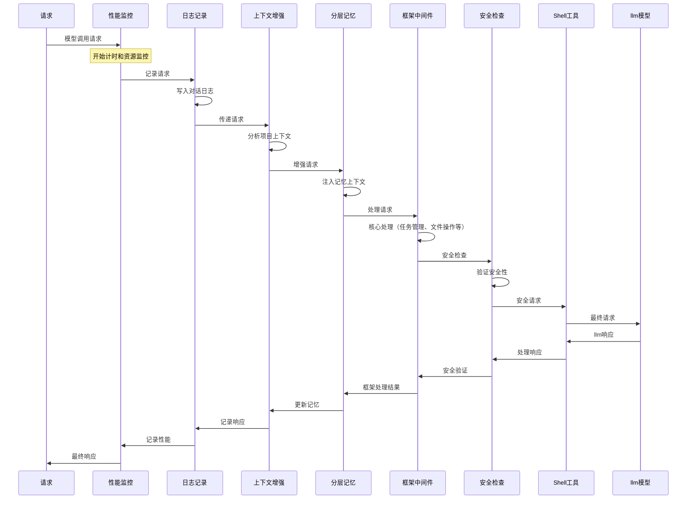

### 1.3 子代理协作架构

Fix Agent 采用的三阶段协作模式，每个阶段由专业子代理负责：

#### 专业子代理团队

**1. 缺陷分析专家 (defect-analyzer)**：
- **核心能力**: 语法和编译分析、逻辑和算法分析、安全漏洞分析、性能和资源分析、代码质量分析
- **输出格式**: 标准化JSON格式，包含缺陷ID、类型、严重程度、文件路径、行号、详细描述、影响分析、修复建议、修复复杂度
- **分析维度**: 全面深入的代码质量检查，覆盖安全、性能、可维护性等多个方面

**2. 代码修复专家 (code-fixer)**：
- **修复策略**: 最小改动修复、重构优先策略、防御式编程、算法优化
- **修复原则**: 最小化修复，不改变原有业务逻辑，保持向后兼容性，添加边界检查和错误处理
- **能力矩阵**: 语法和编译修复、逻辑缺陷修复、性能优化修复、安全漏洞修复、代码质量提升

**3. 修复验证专家 (fix-validator)**：
- **验证方法**: 静态代码分析、边界条件测试、异常情况模拟、性能基准对比、安全扫描检查
- **质量标准**: 功能正确性、可靠性、性能、安全性、可维护性
- **验证输出**: 修复有效性评估、测试结果详情、发现的新问题、最终质量评级

#### 协作工作流

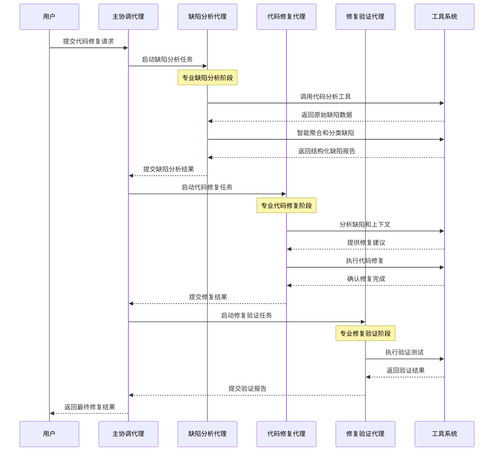


### 1.4 CLI/UI架构设计

Fix Agent 采用了现代化的终端用户界面设计，提供流畅的交互体验。

#### CLI核心架构设计

**分层架构 (Layered Architecture)**：
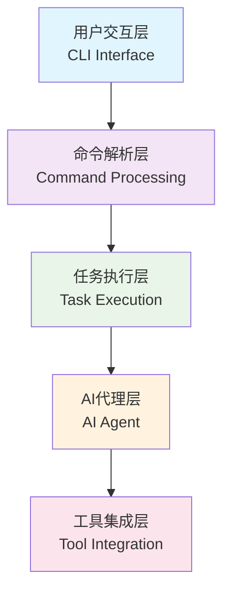

**异步优先 (Async-First Design)**：
- 使用 `asyncio` 作为核心事件循环
- 支持非阻塞的用户输入处理
- 实现流式AI响应显示
- 优雅的中断处理机制

**用户体验优先 (UX-First Design)**：
- **即时响应**: 用户输入立即得到反馈
- **视觉丰富**: 使用Rich库提供美观的终端UI
- **智能补全**: 支持命令、文件路径的自动补全
- **状态感知**: 实时显示agent思考和执行状态

#### CLI启动流程

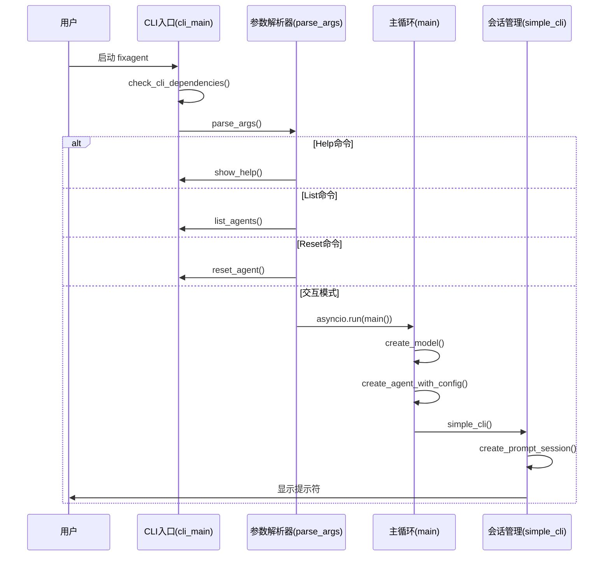

#### 动态UI系统

项目实现了动态的命令行界面，提供丰富的用户交互体验：

```python
class DynamicCLI:
    """动态CLI界面管理器"""

    def __init__(self):
        self.console = Console(highlight=False)
        self.session_state = SessionState()
        self.thinking_spinner = None
        self.current_context = ""

    async def handle_user_input(self, prompt_session):
        """处理用户输入的异步循环"""
        while True:
            try:
                # 显示AI思考状态
                self.show_thinking_indicator()

                # 获取用户输入
                user_input = await prompt_session.prompt_async(
                    self.format_prompt(),
                    completer=self.create_completer(),
                    multiline=True
                )

                # 处理特殊命令
                if await self.handle_special_commands(user_input):
                    continue

                # 处理普通对话
                await self.process_conversation(user_input)

            except KeyboardInterrupt:
                self.handle_interrupt()
            except Exception as e:
                self.handle_error(e)
```

### 1.5 Web应用架构

除了CLI界面，还提供了Web界面支持，后端代码最大程度复用

#### Web应用技术栈

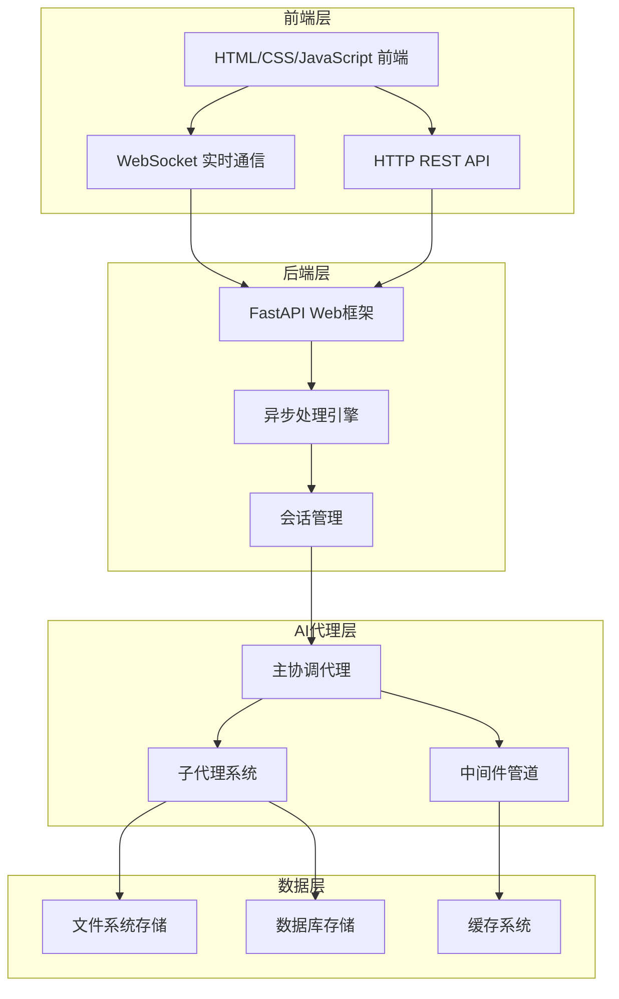

#### FastAPI集成架构

```python
# web_app/main.py
from fastapi import FastAPI, WebSocket, WebSocketDisconnect
from fastapi.middleware.cors import CORSMiddleware
from pydantic import BaseModel

app = FastAPI(title="Fix Agent Web API")

# 配置CORS
app.add_middleware(
    CORSMiddleware,
    allow_origins=["*"],
    allow_credentials=True,
    allow_methods=["*"],
    allow_headers=["*"],
)

class ChatRequest(BaseModel):
    message: str
    session_id: str
    agent_config: Optional[Dict[str, Any]] = None

class ChatResponse(BaseModel):
    response: str
    session_id: str
    timestamp: str
    agent_thinking: Optional[str] = None

@app.websocket("/ws/{session_id}")
async def websocket_endpoint(websocket: WebSocket, session_id: str):
    """WebSocket端点，支持实时通信"""
    await websocket.accept()

    try:
        # 创建会话代理
        agent = create_web_agent(session_id)

        while True:
            # 接收用户消息
            data = await websocket.receive_json()
            user_message = data.get("message", "")

            # 显示思考状态
            await websocket.send_json({
                "type": "thinking",
                "status": "processing",
                "message": "AI正在思考中..."
            })

            # 处理消息
            response = await process_agent_message(agent, user_message)

            # 发送响应
            await websocket.send_json({
                "type": "response",
                "response": response,
                "session_id": session_id,
                "timestamp": datetime.now().isoformat()
            })

    except WebSocketDisconnect:
        # 处理断开连接
        cleanup_session(session_id)
    except Exception as e:
        await websocket.send_json({
            "type": "error",
            "error": str(e)
        })
```

#### 实时功能特性

**流式响应显示**：
```python
async def stream_response(websocket: WebSocket, agent_response):
    """流式发送AI响应"""

    if hasattr(agent_response, 'content'):
        # 分块发送响应内容
        content = agent_response.content
        chunk_size = 100

        for i in range(0, len(content), chunk_size):
            chunk = content[i:i + chunk_size]
            await websocket.send_json({
                "type": "content_chunk",
                "content": chunk,
                "completed": i + chunk_size >= len(content)
            })
            await asyncio.sleep(0.1)  # 控制发送速度
```

**实时状态同步**：
```python
class SessionManager:
    """会话管理器"""

    def __init__(self):
        self.active_sessions = {}
        self.session_history = {}

    async def create_session(self, session_id: str, user_config: Dict[str, Any]):
        """创建新的Web会话"""
        agent = create_agent_with_config(
            model=create_model(),
            assistant_id=session_id,
            tools=get_available_tools(),
            **user_config
        )

        self.active_sessions[session_id] = {
            "agent": agent,
            "created_at": datetime.now(),
            "last_activity": datetime.now(),
            "message_count": 0
        }

        return agent

    async def cleanup_session(self, session_id: str):
        """清理会话资源"""
        if session_id in self.active_sessions:
            session = self.active_sessions[session_id]
            if hasattr(session["agent"], "cleanup"):
                await session["agent"].cleanup()
            del self.active_sessions[session_id]
```

## 2. Agent感知、决策、执行模块分析

### 2.1 感知模块 (Perception)

**项目结构感知**：
- 自动检测项目类型和技术栈
- 分析文件依赖关系和模块结构
- 识别编码规范和项目配置

**代码质量感知**：
- 多语言静态分析集成
- 实时错误检测和分类
- 代码复杂度和可维护性评估

**用户偏好感知**：
- 学习用户的编码风格和偏好
- 记录历史修复模式和选择
- 适应不同项目的特殊要求

### 2.2 决策模块 (Decision)

**智能缺陷分析**：
- 基于语义相似度的缺陷聚类
- 修复复杂度和优先级评估
- 根因分析和修复策略制定

**修复策略选择**：
- 根据缺陷类型选择合适的修复策略
- 平衡代码质量和性能影响
- 考虑向后兼容性和API稳定性

**质量控制决策**：
- 多维度修复效果评估
- 风险评估和安全检查
- 修复方案优化和迭代改进

### 2.3 执行模块 (Execution)

**精确代码修复**：
- 最小化改动原则
- 保持原有业务逻辑完整性
- 防御性编程和错误处理增强

**全面验证测试**：
- 静态分析和动态测试结合
- 边界条件和异常情况验证
- 性能回归测试

**持续质量监控**：
- 修复后代码质量跟踪
- 长期效果评估和反馈
- 知识积累和模式学习

## 3. 工具集成分析

### 3.1 LangChain集成深度

**框架选择**：
- 基于LangChain 1.0构建，利用其成熟的Agent框架
- 集成LangGraph进行复杂工作流管理
- 使用LangChain工具系统实现统一接口

**核心能力**：
- **模型管理**: 支持OpenAI和Anthropic模型，可配置切换
- **记忆系统**: 集成LangChain的记忆机制，并扩展为三层记忆架构
- **工具调用**: 统一的工具调用接口，支持异步和批量操作
- **中间件系统**: 自定义中间件扩展LangChain功能

### 3.2 工具链完整性

**代码分析工具**：
```python
# 核心分析工具
analyze_code_defects()    # 一站式智能代码缺陷分析
analyze_code_complexity() # 代码复杂度分析
aggregate_defects()       # 缺陷智能聚合和分类
```

**错误检测工具**：
```python
# 编译和运行时错误检测
compile_project()           # 多语言编译检查
run_and_monitor()          # 运行时错误监控
run_tests_with_error_capture() # 测试错误捕获
analyze_existing_logs()    # 日志错误分析
```

**代码修复工具**：
```python
# 代码修复和格式化
format_code_professional() # 专业代码格式化
batch_format_professional() # 批量格式化
generate_validation_tests_tool() # 验证测试生成
```

### 3.3 工具调用逻辑

**智能工具选择**：
- 根据文件类型自动选择合适的分析工具
- 基于项目配置调整工具参数
- 支持工具链组合和并行执行

**错误处理和恢复**：
- 工具执行失败的自动重试机制
- 优雅降级和替代方案选择
- 详细的错误报告和修复建议

## 4. Agent完整工作流分析

### 4.1 缺陷检测工作流

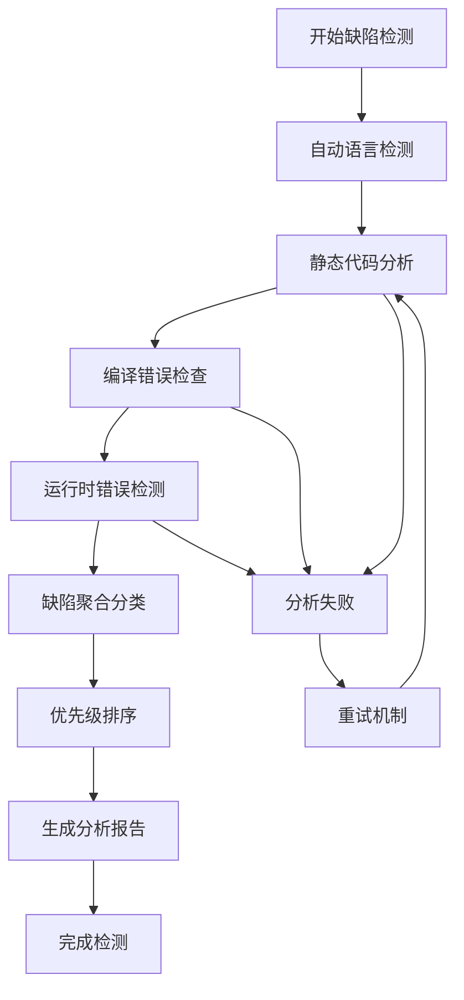

**关键特性**：
- **多语言支持**: Python、JavaScript、Java、C/C++、Go、Rust
- **智能检测**: 自动识别项目类型和技术栈
- **全面分析**: 静态分析+动态检测+编译检查
- **智能聚合**: 基于语义相似度的缺陷去重和聚类

### 4.2 代码修复工作流

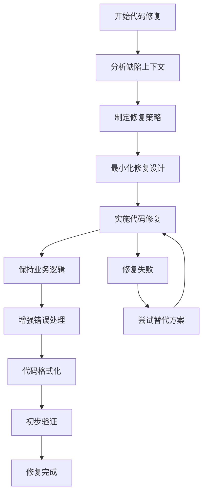

**修复原则**：
- **最小改动**: 只修改解决问题所必需的代码
- **功能保持**: 确保修复不改变原有业务逻辑
- **向后兼容**: 保持API和接口的向后兼容性
- **防御编程**: 添加边界检查和错误处理

### 4.3 修复验证工作流

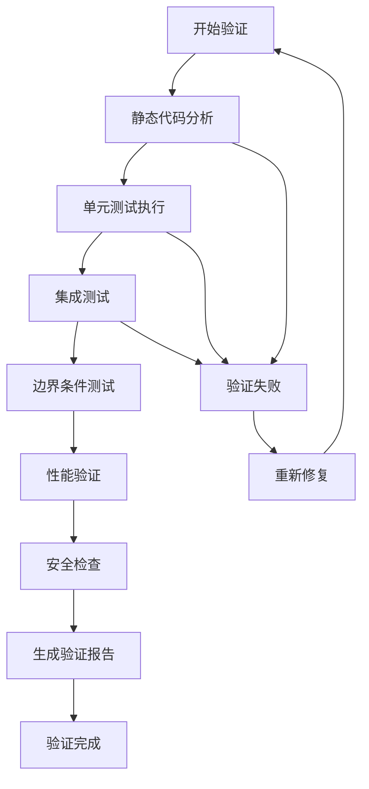

**验证维度**：
- **功能正确性**: 确保修复后功能正常
- **性能影响**: 验证修复对性能的影响
- **安全性**: 检查是否引入安全漏洞
- **可维护性**: 评估代码质量和可读性

## 5. 自主执行能力评估

### 5.1 智能化程度分析

**缺陷检测智能化**: (9/10)
- 多语言自动检测和工具选择
- 基于语义相似度的智能缺陷聚合
- 自动优先级评估和修复复杂度分析

**代码修复智能化**:  (8/10)
- 智能修复策略制定和方案选择
- 自动化代码生成和格式化
- 考虑上下文的最小化修复

**质量验证智能化**:  (7/10)
- 多维度自动验证和测试
- 智能回归测试和性能检查
- 自动化验证报告生成

### 5.2 自主性评估

**自主决策能力**: (8/10)
- 独立的缺陷分析和分类决策
- 自动的修复策略选择和优化
- 智能的工具调用和参数调整

**自主学习能力**:  (7/10)
- 用户偏好和项目模式学习
- 历史修复经验和知识积累
- 持续的质量监控和反馈优化

**自主适应能力**:(7/10)
- 不同项目类型和技术栈适应
- 动态环境变化和配置调整
- 错误恢复和故障自我修复

### 5.3 人机协作模式

**Human-in-the-Loop机制**：
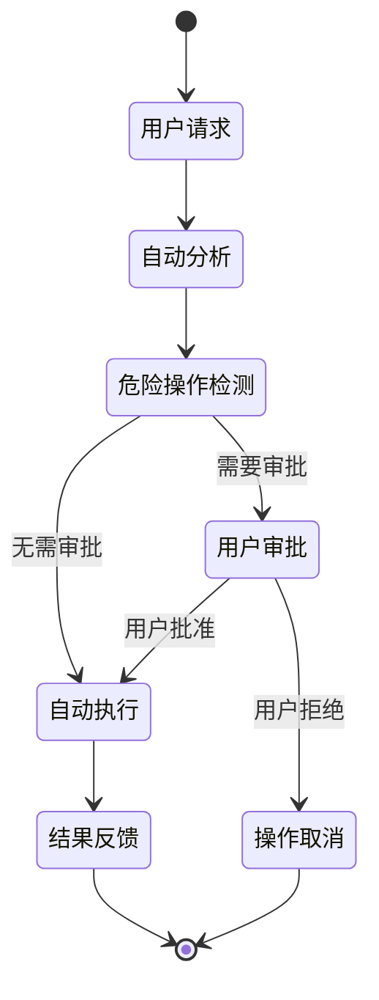

**审批机制**：
- **文件操作审批**: 显示文件路径、操作类型、影响范围
- **命令执行审批**: 显示具体命令、工作目录、安全评估
- **子代理任务审批**: 显示任务描述、预期结果、资源需求

## 6. 创新点分析

### 6.1 架构创新

**三层子代理协作架构**：
- **专业化分工**: 每个子代理专注于特定领域，提高专业能力
- **流水线处理**: 标准化的协作流程，确保处理质量
- **智能协调**: 主协调代理负责任务分配和结果整合

**分层记忆系统**：
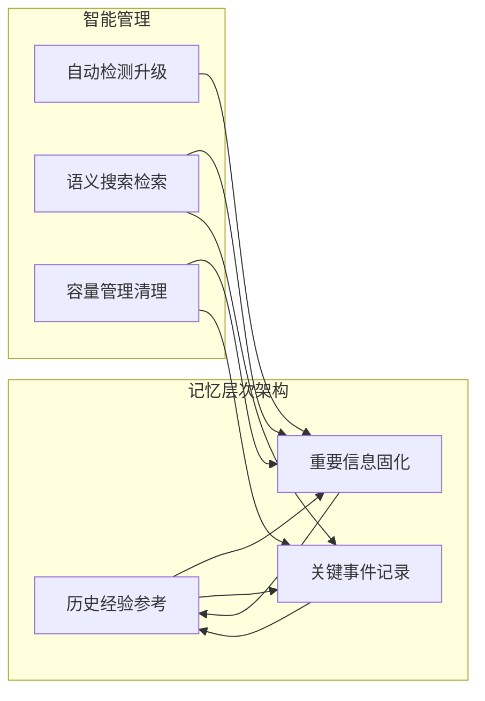

**分层中间件管道**：
- 6层中间件架构，从监控到执行的完整处理链路
- 模块化设计，支持灵活的功能扩展和定制
- 顺序执行保证，确保处理的完整性和一致性

### 6.2 技术创新

**智能缺陷聚合算法**：
- 基于语义相似度的缺陷聚类算法
- 多维度相似度计算（文件、位置、消息、规则）
- 智能去重和根因分析
- 自动优先级评估和修复复杂度分析

**多语言统一接口**：
- 统一的代码分析工具接口
- 自动语言检测和工具选择
- 标准化的缺陷报告格式
- 跨语言的质量评估体系

**AI驱动的安全机制**：
- 多级安全防护和智能风险评估
- 基于上下文的敏感信息检测
- 动态安全策略调整
- 完整的安全审计和追踪

### 6.3 应用创新

**一站式代码质量解决方案**：
- 从缺陷检测到修复验证的完整闭环
- 多工具集成和统一管理
- 智能化的工作流程优化

**个性化开发助手**：
- 用户偏好学习和模式识别
- 项目特定的知识积累
- 自适应的交互方式和界面
- 持续的智能化改进

## 7. 现有方法不足分析

### 7.1 技术层面

**性能优化空间**：
- 大型项目处理性能有待提升
- 并行处理能力可以进一步增强
- 内存使用和资源管理需要优化

**扩展性限制**：
- 新语言和工具的集成复杂度较高
- 插件化架构不够完善

### 7.2 用户体验层面

**交互方式单一**：
- 主要依赖命令行交互
- Web界面功能相对简单


## 8. 改进方案和发展方向


**完善Git集成**：
- 深度Git操作集成
- 智能分支管理和合并建议
- 代码审查和协作支持

**优化性能表现**：
- 大型项目处理优化
- 并行处理能力增强
- 缓存机制和增量处理


**可视化界面**：
- 丰富的可视化分析报告
- 交互式Web界面
- 实时监控仪表板

## 9. 软件工程设计思想深度分析

### 9.1 设计模式应用

#### 9.1.1 工厂模式 (Factory Pattern)

在记忆中间件创建中运用了工厂模式，实现了灵活的对象创建和配置管理：

```python
# src/midware/memory_adapter.py
class MemoryMiddlewareFactory:
    """记忆中间件工厂类"""

    @staticmethod
    def create_legacy_memory(...) -> AgentMemoryMiddleware:
        """创建传统的记忆中间件"""
        return create_memory_middleware(
            backend=backend, memory_path=memory_path, mode="legacy", **kwargs
        )

    @staticmethod
    def auto_upgrade_memory(...):
        """自动选择最佳记忆配置 - 智能工厂方法"""
        if enable_layered is None:
            # 自动检测：如果原有agent.md存在，使用混合模式
            try:
                agent_data = backend.read("/agent.md")
                if agent_data and agent_data.strip():
                    # 有现有记忆，使用混合模式
                    return MemoryMiddlewareFactory.create_hybrid_memory(...)
                else:
                    # 无现有记忆，使用分层模式
                    return MemoryMiddlewareFactory.create_layered_memory(...)
```

**设计优势**：
- **解耦创建逻辑**: 将复杂的对象创建过程封装在工厂中
- **支持多态**: 根据不同条件创建不同类型的记忆中间件
- **智能决策**: 自动检测现有状态并选择最优配置
- **向后兼容**: 支持传统和新型记忆系统的平滑过渡

#### 9.1.2 策略模式 (Strategy Pattern)

在模型创建过程中，项目使用策略模式来支持不同的AI服务提供商：

```python
# src/config/config.py
def create_model():
    """根据可用的API密钥创建适当的模型"""
    openai_key = os.environ.get("OPENAI_API_KEY")
    anthropic_key = os.environ.get("ANTHROPIC_API_KEY")

    # 获取通用配置
    temperature = float(os.environ.get("MODEL_TEMPERATURE", "0.3"))
    max_retries = int(os.environ.get("MODEL_MAX_RETRIES", "3"))

    if openai_key:
        # OpenAI策略
        from langchain_openai import ChatOpenAI
        model_kwargs = {
            "model": model_name,
            "temperature": temperature,
            "api_key": openai_key,
        }
        return ChatOpenAI(**model_kwargs)

    if anthropic_key:
        # Anthropic策略
        from langchain_anthropic import ChatAnthropic
        model_kwargs = {
            "model_name": model_name,
            "temperature": temperature,
            "api_key": anthropic_key,
        }
        return ChatAnthropic(**model_kwargs)
```

**设计优势**：
- **算法封装**: 不同AI提供商的配置逻辑被独立封装
- **运行时选择**: 根据环境配置动态选择合适的策略
- **易于扩展**: 新增AI提供商只需添加新的策略分支
- **配置统一**: 通用配置参数在所有策略间共享

#### 9.1.3 装饰器模式 (Decorator Pattern)

项目通过中间件管道实现了装饰器模式，为Agent核心功能添加各种增强功能：

```python
# src/agents/agent.py
def create_agent_with_config(...):
    # 建中间件管道 - 装饰器链
    agent_middleware = []

    # 第一层装饰器：性能监控
    performance_middleware = PerformanceMonitorMiddleware(...)
    agent_middleware.append(performance_middleware)

    # 第二层装饰器：日志记录
    logging_middleware = LoggingMiddleware(...)
    agent_middleware.append(logging_middleware)

    # 第三层装饰器：上下文增强
    context_middleware = ContextEnhancementMiddleware(...)
    agent_middleware.append(context_middleware)

    # 第四层装饰器：记忆系统
    memory_middleware = MemoryMiddlewareFactory.auto_upgrade_memory(...)
    if isinstance(memory_middleware, list):
        agent_middleware.extend(memory_middleware)
    else:
        agent_middleware.append(memory_middleware)

    # 第五层装饰器：安全检查
    security_middleware = SecurityMiddleware(...)
    agent_middleware.append(security_middleware)

    # 核心Agent被多层装饰器包装
    agent = create_deep_agent(
        model=model,
        middleware=agent_middleware,  # 装饰器链
        ...
    )
```

**设计优势**：
- **功能增强**: 在不修改核心Agent的前提下添加各种功能
- **动态组合**: 可以灵活组合不同的中间件装饰器
- **关注分离**: 每个装饰器专注于特定功能
- **管道处理**: 形成处理管道，请求按顺序通过各层装饰器

#### 9.1.4 适配器模式 (Adapter Pattern)

项目通过适配器模式统一了不同工具和服务的接口：

```python
# src/tools/tools.py
# 适配器模式：统一不同工具的接口
from .defect_aggregator import aggregate_defects_tool as aggregate_defects
from .error_detector import (analyze_existing_logs, compile_project,
                             run_and_monitor, run_tests_with_error_capture)
from .multilang_code_analyzers import analyze_code_file as analyze_file
from .network_tools import http_request, web_search
from .professional_formatter import (batch_format_professional,
                                     format_code_professional)

# 统一的工具接口适配
@tool(description="智能代码缺陷分析工具链...")
def analyze_code_defects(file_path: str, language: Optional[str] = None) -> str:
    """适配器：将多种代码分析工具统一为单一接口"""
    try:
        # 第一步：执行代码静态分析
        analysis_result = analyze_file.invoke(
            {"file_path": file_path, "language": language}
        )

        # 第二步：智能聚合分析结果
        if analysis_result and "issues" in analysis_result:
            aggregation_result = aggregate_defects.invoke(
                {"defects_json": json.dumps(analysis_result)}
            )
            return json.dumps({
                "success": True,
                "analysis": analysis_result,
                "aggregation": json.loads(aggregation_result) if aggregation_result else None
            })
    except Exception as e:
        return json.dumps({"success": False, "error": str(e)})
```

**设计优势**：
- **接口统一**: 将不同功能的工具适配为统一接口
- **复杂度隐藏**: 隐藏了多工具协作的复杂性
- **简化调用**: 提供一站式服务接口
- **容错处理**: 统一的错误处理和恢复机制

### 9.2 架构设计原则

#### 9.2.1 单一职责原则 (Single Responsibility Principle)

项目中的每个模块都有明确的单一职责：

**性能监控中间件**：
```python
# src/midware/performance_monitor.py
class PerformanceCollector:
    """性能数据收集器 - 专注于性能指标收集"""

    def add_record(self, record: PerformanceRecord) -> None:
        """只负责添加性能记录"""

    def update_tool_stats(self, tool_name: str, execution_time: float, success: bool = True) -> None:
        """只负责更新工具统计"""

    def get_summary(self, time_window_minutes: int = 60) -> Dict[str, Any]:
        """只负责生成性能摘要"""
```

**缺陷聚合器**：
```python
# src/tools/defect_aggregator.py
class DefectAggregator:
    """智能缺陷聚合器 - 专注于缺陷的聚合和分类"""

    def aggregate_defects(self, raw_defects: List[Dict[str, Any]]) -> Dict[str, Any]:
        """只负责缺陷聚合"""

    def _deduplicate_defects(self, defects: List[Dict[str, Any]]) -> List[Dict[str, Any]]:
        """只负责去重"""

    def _cluster_defects(self, defects: List[Dict[str, Any]]) -> List[DefectCluster]:
        """只负责聚类"""
```

#### 9.2.2 开闭原则 (Open/Closed Principle)

项目通过接口抽象和中间件系统实现了对扩展开放、对修改封闭：

**中间件扩展机制**：
```python
# 新的中间件可以轻松添加到管道中，无需修改现有代码
agent_middleware = []

# 现有中间件
agent_middleware.append(PerformanceMonitorMiddleware(...))
agent_middleware.append(LoggingMiddleware(...))

# 新中间件可以无缝集成
agent_middleware.append(CustomNewMiddleware(...))  # 对扩展开放

# 核心Agent创建逻辑无需修改（对修改封闭）
agent = create_deep_agent(middleware=agent_middleware, ...)
```

**工具系统扩展**：
```python
# src/tools/tools.py
# 新工具可以通过导入和装饰器轻松添加
from .new_analyzer import advanced_analysis_tool  # 新工具

__all__ = [
    # 现有工具
    "analyze_code_defects", "aggregate_defects",
    # 新工具（对扩展开放）
    "advanced_analysis_tool",
]
```

#### 9.2.3 依赖倒置原则 (Dependency Inversion Principle)

项目通过抽象接口实现了高层模块与低层模块的解耦：

**后端存储抽象**：
```python
# 所有中间件都依赖BackendProtocol抽象，而不是具体实现
from deepagents.backends.protocol import BackendProtocol

class LayeredMemoryMiddleware(AgentMiddleware):
    def __init__(self, *, backend: BackendProtocol, ...):
        # 依赖抽象，不依赖具体实现
        self.backend = backend

class PerformanceMonitorMiddleware(AgentMiddleware):
    def __init__(self, *, backend: BackendProtocol, ...):
        # 同样依赖抽象
        self.backend = backend
```

**配置系统抽象**：
```python
# src/config/config.py
def get_system_prompt():
    """依赖抽象的系统提示，而不是具体实现"""
    return system_prompt

def get_default_coding_instructions() -> str:
    """通过文件系统抽象获取指令，不依赖具体内容"""
    try:
        return default_prompt_path.read_text(encoding="utf-8")
    except UnicodeDecodeError:
        return get_fallback_prompt()  # 抽象的备用方案
```

### 9.3 防御式编程思想

#### 9.3.1 多层错误处理

项目实现了多层防御式编程机制：

**优雅降级**：
```python
# src/config/config.py
def get_default_coding_instructions() -> str:
    """多层防御式文件读取"""
    try:
        return default_prompt_path.read_text(encoding="utf-8")
    except UnicodeDecodeError:
        # 第一层防御：尝试其他编码
        try:
            return default_prompt_path.read_text(encoding="gbk")
        except UnicodeDecodeError:
            # 第二层防御：使用备用内容
            return get_fallback_prompt()

def create_model():
    """防御式的模型创建"""
    try:
        # 尝试创建模型
        return ChatOpenAI(**model_kwargs)
    except Exception as e:
        # 防御式错误处理
        console.print(f"[bold red]❌ Configuration wizard failed: {e}[/bold red]")
        # 提供详细的解决方案
        console.print("\nPlease set one of the following environment variables:")
        sys.exit(1)
```

**安全检查机制**：
```python
# src/tools/error_detector.py
@dataclass
class ErrorSummary:
    """防御式的错误汇总"""
    total_errors: int
    total_warnings: int
    critical_errors: List[Dict[str, Any]]  # 重点关注严重错误
    recommendations: List[str]  # 提供修复建议

def _init_error_patterns() -> Dict[str, List[str]]:
    """防御式的错误模式初始化"""
    patterns = {
        "python": [r"File \"(.+)\", line (\d+)", ...],
        "javascript": [r"at (.+):(\d+):(\d+)", ...],
        # 为每种语言预定义错误模式
    }
    return patterns  # 确保总是返回有效模式
```

#### 9.3.2 资源保护机制

项目实现了多种资源保护机制：

**线程安全的数据收集**：
```python
# src/midware/performance_monitor.py
class PerformanceCollector:
    def __init__(self, max_history: int = 1000):
        self._lock = threading.Lock()  # 线程安全保护

    def add_record(self, record: PerformanceRecord) -> None:
        with self._lock:  # 保护共享资源
            self.records.append(record)
            if len(self.records) > self.max_history:
                # 防御式资源管理：限制历史记录大小
                self.records = self.records[-self.max_history:]
```

**内存管理保护**：
```python
# src/midware/layered_memory.py
def add_semantic_memory(self, content: str, importance: float = 1.0, tags: List[str] = None):
    """防御式的记忆添加"""
    # 限制语义记忆大小，防止内存泄漏
    if len(self.semantic_memory) > 1000:
        self.semantic_memory.sort(
            key=lambda x: (x["importance"], x["access_count"])
        )
        # 防御式清理：保留重要内容
        self.semantic_memory = self.semantic_memory[-800:]
```

### 9.4 数据驱动设计思想

#### 9.4.1 配置驱动架构

项目大量使用配置驱动的架构设计，提高了系统的灵活性和可配置性：

**环境配置驱动**：
```python
# src/config/config.py
def create_model():
    """配置驱动的模型创建"""
    # 从环境变量读取配置
    temperature = float(os.environ.get("MODEL_TEMPERATURE", "0.3"))
    max_tokens = os.environ.get("MODEL_MAX_TOKENS")
    timeout = os.environ.get("MODEL_TIMEOUT")
    max_retries = int(os.environ.get("MODEL_MAX_RETRIES", "3"))

    # 配置驱动决策
    if openai_key:
        # OpenAI配置分支
        model_kwargs = {
            "model": os.environ.get("OPENAI_MODEL", "gpt-5-mini"),
            "temperature": temperature,  # 配置驱动的参数
            "base_url": os.environ.get("OPENAI_API_BASE"),
        }
```

### 9.5 软件工程最佳实践的体现


**设计模式的恰当运用**：工厂模式、策略模式、装饰器模式、适配器模式等都被巧妙地应用在合适的位置。

**SOLID原则的严格遵循**：每个模块都有单一职责，系统对扩展开放但对修改封闭，依赖抽象而非具体实现。

**防御式编程的全面保护**：多层错误处理、优雅降级、资源保护等机制确保了系统的稳定性和可靠性。

**数据驱动架构的灵活应用**：通过配置驱动实现了高度的灵活性和可配置性。


## 10. 总结

### 10.1 项目优势总结

**架构设计优秀**：
- 模块化、可扩展的系统架构
- 清晰的职责分离和接口设计
- 完善的中间件和安全机制
- 软件工程最佳实践的深度应用

**技术实现先进**：
- 基于最新的LangChain和Deepagents框架
- 创新的三层子代理协作模式
- 智能化的缺陷分析和修复能力
- 多种设计模式的恰当运用

**功能完整性高**：
- 覆盖代码质量管理全流程
- 支持多种编程语言和工具
- 提供企业级的监控和日志系统
- 一站式的解决方案

**安全性保障完善**：
- 多层次的安全防护机制
- 完善的Human-in-the-loop控制
- 详细的审计追踪和监控
- 防御式编程的全面保护

### 9.2 AI4SE理念体现

**智能化软件工程**：
- AI驱动的代码质量分析和管理
- 智能化的缺陷检测和修复
- 自适应的学习和优化机制

**人机协作模式**：
- Human-in-the-loop的安全控制
- 智能化的用户交互体验
- 个性化的开发助手功能

**工程化实践**：
- 完善的监控和日志系统
- 标准化的工作流程和最佳实践
