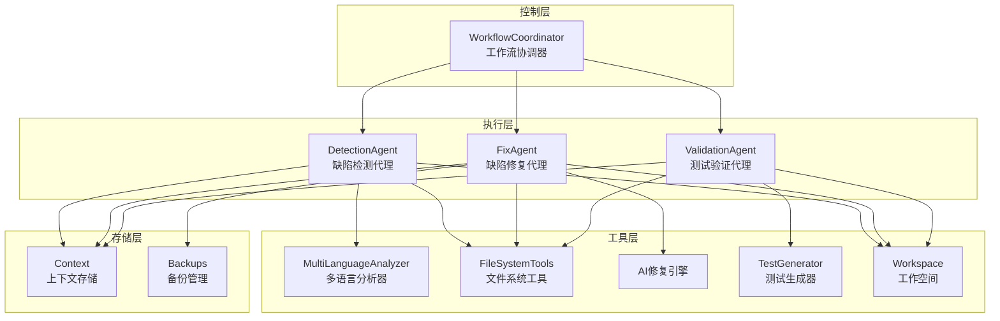

# 三代理缺陷修复工作流系统设计文档

## 系统概述

基于deepagents框架构建的智能化代码缺陷修复工作流系统，实现"检测→修复→验证"的闭环智能循环流程，专门针对小型项目（<100文件）进行优化。

## 核心设计原则

1. **充分利用现有基础设施**：集成已有的multilang_code_analyzers和deepagents工具
2. **智能循环控制**：根据验证结果自动决定是否继续迭代
3. **半自动修复策略**：低风险自动修复，高风险需要人工确认
4. **多语言平等支持**：基于现有分析器支持Python、JavaScript、Java、C/C++、Go、Rust
5. **文件传递机制**：通过文件系统进行代理间上下文传递

## 系统架构



## 数据流设计

### 1. 工作流状态管理

```python
class WorkflowState:
    cycle_id: int              # 当前循环次数
    status: WorkflowStatus     # 当前状态
    project_path: str          # 项目根目录
    workspace_dir: str         # 工作空间目录
    detection_results: Optional[Dict]   # 检测结果
    fix_results: Optional[Dict]         # 修复结果
    validation_results: Optional[Dict]  # 验证结果
    total_defects: int         # 总缺陷数
    fixed_defects: int         # 已修复缺陷数
    failed_fixes: int          # 修复失败数
    start_time: datetime       # 开始时间
    last_update: datetime      # 最后更新时间
```

### 2. 上下文传递格式

每个代理都会生成标准化的上下文文件：

```json
{
  "agent": "detection|fix|validation",
  "cycle_id": 1,
  "timestamp": "2024-01-01T00:00:00Z",
  "status": "completed|failed|partial",
  "input_files": ["src/main.py", "src/utils.py"],
  "output_files": ["workspace/cycle_1/detection/report.json"],
  "metrics": {
    "processing_time": 45.2,
    "defects_found": 15,
    "files_analyzed": 8
  },
  "next_agent": "fix",
  "decisions": {
    "should_continue": true,
    "confidence": 0.85
  },
  "metadata": {
    "tools_used": ["pylint", "eslint", "multilang_analyzer"],
    "language_distribution": {"python": 6, "javascript": 2}
  }
}
```

### 3. 工作空间组织

```
workspace/
├── cycle_1/                           # 第1轮循环
│   ├── detection/                     # 检测结果
│   │   ├── detection_report.json     # 详细检测报告
│   │   ├── defects_summary.md        # 缺陷摘要
│   │   └── detection_context.json    # 检测上下文
│   ├── fixes/                        # 修复结果
│   │   ├── fix_report.json          # 修复报告
│   │   ├── fixed_files/             # 修复后的文件
│   │   ├── backup_files/            # 原始文件备份
│   │   └── fix_context.json         # 修复上下文
│   └── validation/                  # 验证结果
│       ├── validation_report.json   # 验证报告
│       ├── test_results/           # 测试结果详情
│       └── validation_context.json # 验证上下文
├── cycle_2/                         # 第2轮循环
└── context/                         # 全局上下文
    ├── workflow_state.json         # 工作流状态
    ├── project_config.json         # 项目配置
    └── history.log                 # 历史日志
```

## 代理详细设计

### DetectionAgent（缺陷检测代理）

**核心职责：**
1. 项目文件扫描和语言识别
2. 多语言代码质量分析
3. 缺陷分类和优先级评估
4. 生成可操作的缺陷报告

**工具集成：**
- `multilang_code_analyzers`：多语言静态分析
- `filesystem`工具：文件扫描和管理
- `web_search`：查找修复方案参考

**输出格式：**
```json
{
  "defects": [
    {
      "id": "defect_001",
      "file": "src/main.py",
      "line": 25,
      "severity": "high|medium|low",
      "category": "syntax|style|security|performance",
      "message": "Undefined variable 'user_id'",
      "suggested_fix": "Check variable name or ensure it's defined",
      "confidence": 0.95,
      "auto_fixable": true,
      "risk_level": "low"
    }
  ],
  "summary": {
    "total_defects": 15,
    "by_severity": {"high": 3, "medium": 8, "low": 4},
    "by_category": {"syntax": 2, "style": 10, "security": 1, "performance": 2},
    "auto_fixable_count": 12,
    "files_affected": 8
  }
}
```

### FixAgent（缺陷修复代理）

**核心职责：**
1. 分析缺陷报告并制定修复策略
2. 执行低风险自动修复
3. 为高风险修复提供建议
4. 维护修复历史和回滚机制

**修复策略：**
- **Level 1（自动修复）**：格式问题、简单语法错误、导入问题
- **Level 2（确认后修复）**：变量重命名、简单逻辑调整
- **Level 3（仅提建议）**：算法修改、架构变更、复杂重构

**安全机制：**
- 修复前自动备份
- 修复效果预览
- 一键回滚功能
- 修复操作审计

**输出格式：**
```json
{
  "fixes_applied": [
    {
      "defect_id": "defect_001",
      "file": "src/main.py",
      "fix_type": "auto_applied|manual_suggested|skipped",
      "changes": {
        "line": 25,
        "original": "user_id = get_user()",
        "fixed": "user_id = get_user().id"
      },
      "confidence": 0.90,
      "rollback_info": {
        "backup_file": "workspace/cycle_1/fixes/backup_files/main.py.backup",
        "restore_command": "cp backup_file original_file"
      }
    }
  ],
  "summary": {
    "total_fixes": 12,
    "auto_applied": 8,
    "manual_suggested": 4,
    "skipped": 1,
    "success_rate": 0.92
  }
}
```

### ValidationAgent（测试验证代理）

**核心职责：**
1. 针对修复生成专门测试用例
2. 执行回归测试防止新缺陷
3. 验证修复的有效性
4. 生成质量改进报告

**测试策略：**
- **单元测试**：针对修复函数的专门测试
- **集成测试**：修复影响的模块测试
- **回归测试**：原有功能完整性检查
- **静态分析**：修复后代码质量重评估

**输出格式：**
```json
{
  "test_results": [
    {
      "test_type": "unit|integration|regression",
      "test_name": "test_user_id_fix",
      "status": "passed|failed|skipped",
      "execution_time": 0.05,
      "details": "Test validates user_id assignment fix"
    }
  ],
  "validation_summary": {
    "tests_run": 15,
    "passed": 13,
    "failed": 2,
    "coverage": 85.2,
    "new_issues": 0,
    "quality_improvement": "+12.5%"
  },
  "recommendation": {
    "should_continue": true,
    "next_focus": ["failed_tests", "new_defects"],
    "confidence": 0.78
  }
}
```

## WorkflowCoordinator（工作流协调器）

**核心职责：**
1. 工作流状态管理和持久化
2. 代理执行顺序控制
3. 智能循环决策
4. 异常处理和恢复

**循环控制逻辑：**
```python
def should_continue_workflow(state: WorkflowState) -> Decision:
    """
    决定是否继续工作流循环
    """
    # 达到最大循环次数
    if state.cycle_id >= MAX_CYCLES:
        return Decision(stop, "达到最大循环次数")

    # 没有剩余缺陷
    if state.total_defects == 0:
        return Decision(stop, "所有缺陷已修复")

    # 连续三轮无改进
    if state.improvement_rate < MIN_IMPROVEMENT for last 3 cycles:
        return Decision(stop, "连续无改进")

    # 验证失败但仍有修复空间
    if state.validation_failed and state.potential_fixes > 0:
        return Decision(continue, "验证失败，继续修复")

    return Decision(continue, "仍有缺陷需要处理")
```

## 上下文管理机制

### 文件传递协议

1. **标准化的上下文文件**：每个代理生成统一的JSON格式上下文
2. **原子性操作**：文件写入使用临时文件+重命名确保原子性
3. **版本控制**：保留每次修改的完整历史
4. **冲突解决**：基于时间戳的自动冲突处理

### 状态同步机制

```python
class ContextManager:
    def save_agent_context(self, agent_name: str, context: Dict):
        """保存代理上下文"""
        context_file = f"{self.workspace_dir}/cycle_{self.cycle_id}/{agent_name}_context.json"
        with atomic_write(context_file) as f:
            json.dump(context, f, indent=2)

    def load_previous_context(self, agent_name: str) -> Optional[Dict]:
        """加载前一轮的代理上下文"""
        prev_cycle = self.cycle_id - 1
        if prev_cycle > 0:
            context_file = f"{self.workspace_dir}/cycle_{prev_cycle}/{agent_name}_context.json"
            if os.path.exists(context_file):
                return json.load(open(context_file))
        return None
```

## 智能决策机制

### 循环终止条件

1. **成功条件**：
   - 零缺陷状态
   - 质量评分达到阈值
   - 验证全部通过

2. **失败条件**：
   - 达到最大循环次数（默认10次）
   - 连续3轮无显著改进
   - 出现无法恢复的错误

3. **人工干预点**：
   - 高风险修复确认
   - 修复策略选择
   - 异常情况处理

### 动态调整策略

```python
class AdaptiveStrategy:
    def adjust_parameters(self, state: WorkflowState):
        """根据当前状态动态调整策略"""
        if state.cycle_id > 5:
            # 后期更保守的修复策略
            self.risk_tolerance *= 0.8

        if state.validation_results['failure_rate'] > 0.3:
            # 高失败率时降低自动修复阈值
            self.auto_fix_threshold *= 0.9
```

## 性能优化策略

### 小型项目优化

1. **全量分析**：由于文件数量少，可以进行全项目分析
2. **增量更新**：只重新分析修改的文件
3. **并行处理**：多个文件并行分析
4. **缓存机制**：分析结果缓存避免重复计算

### 资源管理

1. **工作空间清理**：定期清理旧的循环目录
2. **内存优化**：大型文件分块处理
3. **并发控制**：限制同时运行的代理数量

## 监控和日志

### 结构化日志

```json
{
  "timestamp": "2024-01-01T00:00:00Z",
  "cycle_id": 1,
  "agent": "detection",
  "level": "INFO|WARNING|ERROR",
  "message": "完成代码缺陷检测",
  "metrics": {
    "files_processed": 8,
    "defects_found": 15,
    "processing_time": 45.2
  },
  "context": {
    "project_path": "/path/to/project",
    "workspace_dir": "/path/to/workspace"
  }
}
```

### 进度监控

1. **实时进度显示**：当前循环、代理状态、完成度
2. **性能指标**：处理时间、成功率、改进率
3. **质量趋势**：缺陷数量变化、质量评分趋势

## 扩展性设计

### 新代理集成

```python
class AgentRegistry:
    def register_agent(self, agent_class: Type[BaseAgent]):
        """注册新的代理类型"""
        self.agents[agent_class.__name__] = agent_class

    def create_workflow(self, agents: List[str]):
        """动态创建工作流"""
        return [self.agents[name] for name in agents]
```

### 插件化工具

1. **工具接口标准化**：统一的工具调用接口
2. **动态加载**：运行时加载新工具
3. **配置管理**：工具参数和策略配置

这个设计充分利用了现有的multilang_code_analyzers和deepagents工具，针对小型项目进行了优化，实现了智能循环控制和半自动修复策略。